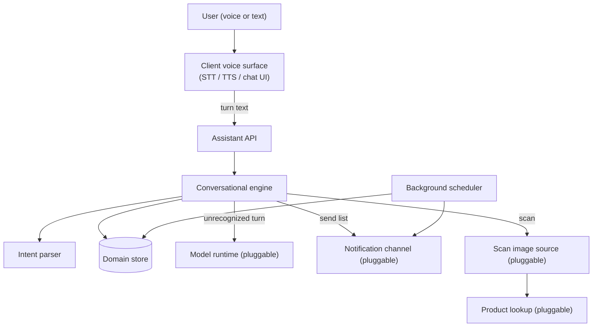
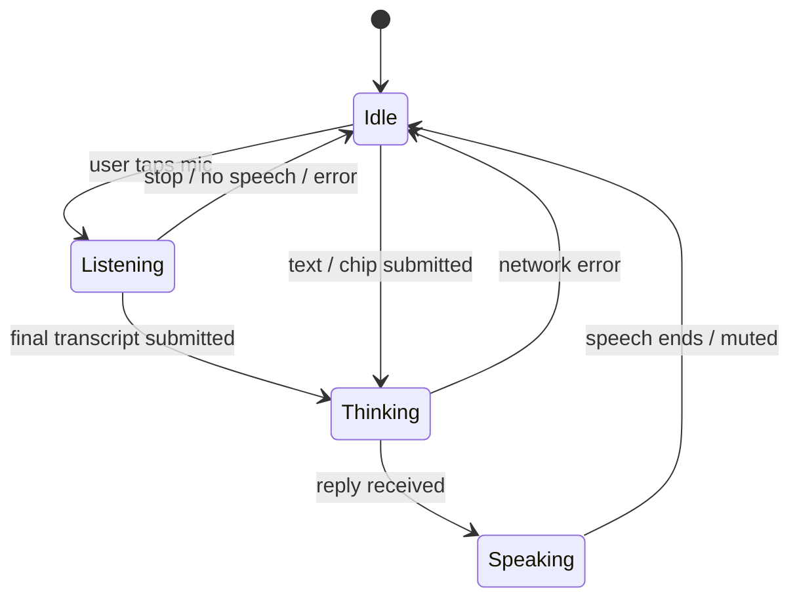

# AI Assistant System — Functional Specification

> **Document type:** Abstract external specification (clean-room).
> **Purpose:** Define the observable behavior, contracts, state transitions, and edge
> cases of a local, hybrid (deterministic + LLM) conversational inventory assistant,
> so the `custom_business_suite/assistant` module can be reimplemented from
> requirements rather than from a copy of the reference implementation.
>
> This document describes **what** the system does, not **how** it is coded. It
> contains no source code, pseudo-code, query text, or pattern literals. The
> reference implementation observed while writing this spec runs on a Raspberry-Pi
> security appliance; anything specific to that host is called out as an
> *Implementation note* and should be treated as a replaceable adapter, not a
> requirement.

---

## 1. Overview & Purpose

The system is a **natural-language assistant for tracking household and workshop
items** — where things are stored, how many there are, and what lists/categories they
belong to. A user interacts in plain language, by voice or by text, and the assistant
records, retrieves, counts, moves, and reports on items, and can answer free-form
questions.

The defining design choice is a **hybrid, deterministic-first pipeline**:

- The vast majority of requests are resolved by a **fast rule-based intent parser**
  that maps recognized phrasings to a fixed set of structured operations against a
  local database. This path is exact, side-effect-predictable, and effectively
  instantaneous.
- Only requests that the rule parser does not recognize fall through to a **local
  language model**, which is given a compact summary of current inventory and
  categories as grounding context and asked to reply conversationally.

**Rationale.** The rule path guarantees correctness and near-zero latency for the
operations that mutate data, and avoids asking a small local model to hold large
item lists in its context (which would be slow and error-prone). The model is used
only where deterministic parsing cannot help — general conversation and open
questions. This keeps mutations trustworthy while still allowing a natural,
open-ended feel.

**Design principles (requirements).**

- **Local-first / offline-capable.** Core capture, storage, and retrieval must
  function without any external network dependency. External calls (model, product
  lookups, notifications) are enhancements, and their absence must degrade
  gracefully, never fail hard.
- **Deterministic mutations.** Any operation that changes stored data must be driven
  by the rule path, not by the probabilistic model.
- **Every turn produces a spoken-quality reply.** All responses are short,
  direct sentences suitable for text-to-speech playback.
- **Persistent conversation memory.** Every user turn and assistant reply is recorded
  and can be replayed to rehydrate a session.

---

## 2. System Context & Actors

### 2.1 Actors and external roles

| Actor / role | Responsibility |
| :--- | :--- |
| **User** | Speaks or types natural-language requests; hears/reads replies. |
| **Conversational engine** | Orchestrates each turn: parse → act or defer → reply. |
| **Intent parser** | Classifies a request into one structured operation, or none. |
| **Domain store** | Persistent record of items, categories, history, mappings, schedules, and pending conversational context. |
| **Language model runtime** (pluggable) | Answers unrecognized requests, grounded in a supplied context summary. |
| **Notification channel(s)** (pluggable) | Delivers list contents to an outside destination (e.g. a messaging service). |
| **Product-lookup service** (pluggable, optional) | Resolves a scanned code to a product name/brand/category. |
| **Image/scan source** (pluggable, optional) | Supplies an image frame for code scanning. |
| **Client voice surface** | Captures speech, renders the conversation, speaks replies. |

### 2.2 Pluggable interfaces (portability requirement)

The reference implementation hard-wires several concrete providers. The suite
reimplementation must treat each as an **interface with a swappable adapter**:

- **Model runtime interface** — "given a prompt and a grounding context, return a
  short text completion." Implementation note: the reference uses a small local
  instruction-tuned model served over a local HTTP endpoint with a small context
  window, low temperature, non-streaming, and a bounded timeout.
- **Notification interface** — "given a formatted list message and a target channel,
  deliver it and report which channels succeeded." Implementation note: the reference
  supports two messaging services selectable individually or together.
- **Product-lookup interface** — "given a scanned code, return product details or
  nothing." Implementation note: the reference checks a local cache first, then an
  external product database, then falls back to a placeholder record.
- **Scan-image-source interface** — "produce a still image to decode." Implementation
  note: the reference triggers a camera snapshot and reads the resulting file.

### 2.3 Component boundary (informational)

---

## 3. Processing Pipeline (Behavioral Contract)

Each conversational turn is processed as an ordered sequence. This ordering is a
requirement, because both persistence and precedence depend on it.

1. **Empty-input guard.** If the incoming text is empty or whitespace only, return a
   friendly prompt inviting the user to store, list, or find something. No history is
   recorded for an empty turn.
2. **Record the user turn.** The user's text is appended to conversation history
   before any processing, so history is complete even if later steps fail.
3. **Fast intent extraction.** The request is normalized (trimmed, lower-cased,
   trailing sentence punctuation removed) and evaluated against the intent catalog in
   a **fixed priority order** (Section 4). The first match wins and yields a
   structured intent with extracted parameters. If nothing matches, the result is
   "no intent."
4. **Tool dispatch (matched path).** A recognized intent is routed to its handler,
   which performs the side effect (if any) against the domain store or a pluggable
   service, records the assistant reply to history, and returns a structured result.
5. **Model fallback (unmatched path).** If no intent matched, the engine assembles a
   grounding context (Section 6), asks the model runtime for a short reply, records
   it to history, and returns it.
6. **Static fallback.** If the model runtime returns nothing (unreachable, timeout,
   error), the engine records and returns a fixed help message listing example
   phrasings. This guarantees every turn yields a usable reply.

**Response envelope (contract).** Every turn — matched, model, or static — returns an
object containing at minimum:

| Field | Meaning |
| :--- | :--- |
| `reply` | Human-readable, TTS-friendly sentence to display and speak. |
| `action` | A short machine code naming the outcome (e.g. "stored", "found", "llm_chat"). Drives client-side side effects such as data refresh. |
| `items` | A (possibly empty) list of the item records relevant to the reply. |

Additional fields appear per intent (e.g. a saved item, a category record, a
reminder, a product, a send-result, a count). Consumers must tolerate the presence of
extra fields and the absence of intent-specific ones.

---

## 4. Intent Catalog

The parser recognizes the following operations. **Order matters**: entries are tested
top to bottom and the first match is taken, so more specific or higher-priority
intents are listed first. Each entry describes the *meaning* of the phrasings it
matches (not the pattern text), the parameters it extracts, its side effects, and the
`action` code it returns.

| # | Intent | Recognized meaning (examples of phrasing) | Extracted parameters | Side effect | Returned `action` |
| :-- | :--- | :--- | :--- | :--- | :--- |
| 0 | **Confirm-Yes** | An affirmative ("yes", "sure", "add it") **only when a pending confirmation is active and unexpired** | (uses pending context) | Executes the pending action (restock item, or add missing recipe items) | `stored` |
| 0 | **Confirm-No** | A negative ("no", "cancel", "never mind") when a pending confirmation is active | (uses pending context) | Clears pending context; makes no change | `canceled` |
| 1 | **Barcode-Scan** | A request to scan a code from the camera/image source | — | Captures an image, decodes a code, resolves a product, stores it | `barcode_scanned` / `barcode_failed` |
| 2 | **Set-Reminder** | A request to send/remind a list on a schedule ("send my grocery list every Monday at 9am") | list/category, time, day-of-week | Creates a recurring schedule entry | `reminder_created` |
| 2 | **List-Reminders** | "show/list my reminders" | — | Reads schedule entries | `reminders_listed` |
| 3 | **Check-Recipe** | "can I make X" / "do I have what I need for X" | recipe/project name | Compares required items to inventory; may open a confirmation to add missing ones | `recipe_complete` / `recipe_missing` |
| 4 | **Consume / Out-of-stock** | "I finished/used up/ran out of X" | item | Removes the item; opens a restock confirmation | `consumed` / `not_in_inventory` |
| 5 | **Create-Category** | "create/make a new list/category called X" | category name | Creates the category if new | `category_created` |
| 6 | **Delete-Category** | "delete the category/list X" | category name | Deletes the category and its items | `category_deleted` |
| 7 | **Send-List** | "send/share the X list to <channel>" | category, target channel | Formats and dispatches the list to the notification channel(s) | `list_sent` |
| 8 | **List-All-Categories** | "what categories/lists do I have" | — | Reads all categories with counts | `categories_listed` |
| 9 | **Clear-Category** | "clear/empty the X list" (only when target is recognizably a list/category) | category | Deletes all items in the category | `category_cleared` |
| 10 | **Remove-Item-From-Category** | "remove X from the Y list" (target is a list/category) | item, category | Deletes that item within that category | `deleted` / `delete_failed` |
| 11 | **Increment** | "add another X", "add N more X", "increase X by N" | item, amount, optional destination | Raises an item's quantity (creates it if absent) | `stored` |
| 12 | **Decrement** | "I used N X", "reduce X by N" | item, amount, optional destination | Lowers an item's quantity; removal at zero opens a restock confirmation | `stored` / `consumed` / `not_in_inventory` |
| 13 | **Store-with-location / Add-to-category** | "I put N X in/on the Y" | quantity, item, destination | If destination is a list/category → add to that category; else store at that physical location | `stored` |
| 14 | **Show-Category** | "what's in/show me the X list" (target is a list/category) | category | Reads items in the category | `category_listed` |
| 15 | **Store-without-location** | "I bought/got/add X" (no place given) | quantity, item | Stores the item at an inferred default location | `stored` |
| 16 | **Find / Locate** | "where is X", "find X", "where did I put X" | item | Searches inventory; reports location(s) and quantity | `found` / `not_found` |
| 17 | **Count / Quantity** | "how many X do I have", "do I have any X" | item | Sums quantities across matches | `count` / `count_zero` |
| 18 | **List-All** | "list all items", "show my inventory" | — | Reads a capped list of all items | `listed_all` / `empty_inventory` |
| 19 | **List-Location** | "what is in the garage", "list everything in the red toolbox" | location | Reads items at that location | `listed_location` / `empty_location` |
| 20 | **Delete** | "delete/remove/clear X" | item | Removes matching item(s); opens a restock confirmation | `deleted` / `delete_failed` |

**Precedence notes (behavioral requirements).**

- Confirmation handling is checked **first**, and only when a pending context exists;
  otherwise an affirmative/negative word is treated as ordinary input and may fall
  through to the model.
- Quantity change (Increment/Decrement) is tested **before** plain Store so that
  "add another…"/"used N…" are not misread as new-item storage.
- Store-with-location is tested **before** Show-Category and Store-without-location so
  that an explicit destination is honored.
- The distinction between a **physical location** and a **list/category** as the
  destination is decided by a recognizer (Section 7.4): destinations that look like
  lists/categories route to category operations; everything else is treated as a
  storage location.
- Several handlers guard against mis-parsing by rejecting extracted item text that
  begins with question words ("how…", "where…", "what…") or is too short.

---

## 5. Conversational State & Confirmation Flow

The assistant supports a single, short-lived **pending confirmation** to enable
yes/no follow-ups without re-stating the subject.

**Pending-context object (logical).**

| Field | Meaning |
| :--- | :--- |
| type | Which follow-up is pending: a restock offer, or an add-missing-ingredients offer. |
| payload | The subject: the item to restock, or the set of missing items plus a target list. |
| timestamp | When the context was set. |

**Lifecycle & rules.**

- **Set** when a handler ends by asking a yes/no question. Two flows create it:
  1. **Restock offer** — after an item is consumed, deleted, or decremented to zero,
     the assistant offers to add it to the shopping/grocery list.
  2. **Add-missing-ingredients offer** — after a recipe/project check finds missing
     items, the assistant offers to add all of them to the shopping/grocery list.
- **Resolve** on the next turn: an affirmative executes the pending action (adds the
  item, or adds every missing item), a negative discards it. Either way the pending
  context is **cleared** immediately after resolution.
- **Expiry** — a pending context is only honored for a short window (reference:
  **5 minutes**). After that it is ignored even if present, and a "yes"/"no" is
  treated as ordinary input. This prevents a stale confirmation from hijacking a
  later, unrelated affirmative.
- **Single-slot** — only one pending context exists at a time; setting a new one
  replaces any previous one.

---

## 6. Language-Model Fallback Contract

Invoked **only** when the intent parser returns no match.

**Grounding context assembled per call (RAG-style).** The engine builds a compact
context string containing:

- A persona/role line establishing the assistant as a brief, direct home/workshop
  inventory helper.
- A **category summary**: each category name with its item count.
- An **inventory summary**: a capped list of current items with quantity, location,
  and category.
- An explicit brevity instruction (reply in one or two short sentences).

**Generation parameters (as abstract knobs).**

| Knob | Requirement |
| :--- | :--- |
| Determinism | Low randomness (favor consistent, grounded answers). |
| Context size | Small — only the compact summary above is supplied, never the full database. |
| Streaming | Not required; a single complete reply is expected. |
| Timeout | Bounded; on timeout the call is treated as "no reply." |

**Outcomes.**

- **Model replies** → record and return it with `action = llm_chat`.
- **Model returns nothing** (unreachable/timeout/error) → record and return the
  **static help fallback** (a fixed sentence listing example commands) with
  `action = fallback`.

The model is never allowed to perform data mutations; it only produces conversational
text.

---

## 7. Tool / Domain Behaviors

These are the reusable behaviors the intent handlers rely on. Described as rules, not
implementation.

### 7.1 Quantity & number parsing

- Accepts digits, spelled-out numbers, and quantity words (e.g. "a", "couple",
  "few", "several", "dozen").
- Recognizes unit phrases (box, pack, pair, can, bottle, roll, bag, carton, etc.) and
  preserves them as part of the displayed quantity (e.g. "2 boxes").
- Non-quantity determiners ("my", "the", "some", "this"…) are treated as quantity 1.
- Stores both a **display quantity** (may include a unit) and a **numeric quantity**
  (used for counting and increment/decrement math).

### 7.2 Text normalization

- **Item names**: strip leading articles/possessives and trailing linking verbs;
  trim surrounding punctuation.
- **Locations**: strip leading prepositions ("in", "on", "at", "inside", "to") and
  articles/possessives.
- **Categories**: strip "category"/"list"/"called"/"named" scaffolding and
  articles; correct common misspellings of "grocery"; map well-known aliases to
  canonical names (grocery/shopping/wishlist/to-do/tools/hardware/electronics/
  household/pantry); title-case the remainder; default to a general bucket if empty.

### 7.3 Category auto-detection & icons

- When an item is stored without an explicit category, a category is **inferred from
  keywords** in the item/location text (tools, electronics, hardware, household/food,
  etc.), defaulting to a general bucket.
- Each category is assigned a representative **icon** by keyword (shopping, tools,
  hardware, electronics, pantry, wishlist, to-do, garden, books, medical, auto, home,
  storage…), with a generic folder icon as default.
- A default set of seed categories is created on first initialization.
- Categories referenced only implicitly (present on items but never explicitly
  created) are **auto-registered** when categories are listed, so the catalog stays
  consistent.

### 7.4 List/category vs. physical-location recognizer

A destination phrase is classified as a **list/category** (rather than a physical
place) when it matches a known list/category name, ends with "list"/"category",
begins with "category"/"list", or is a well-known list alias. This decides whether
"put X in Y" adds to a category or records a storage location.

### 7.5 Default-location inference

When an item is stored with no location and the category is not itself a list, a
**default physical location** is inferred from the item's nature (e.g. frozen →
freezer, perishable → fridge, tools → workshop, small electronics → a drawer, dry
goods → pantry, toiletries → bathroom), with a general-storage default. Items
belonging to shopping/to-do/wishlist style lists use the list as their "location."

### 7.6 Item search (tiered)

Finding an item proceeds from most to least precise, returning at the first tier
that yields results:

1. Exact name match (optionally constrained to a category).
2. Substring match across name, location, and category.
3. Token/stem match — the query and each item's text are reduced to lower-cased,
   stop-word-filtered word stems and compared, allowing a near-complete overlap to
   count as a match. This provides tolerance for plurals and minor phrasing
   differences.

### 7.7 Add-or-update semantics

Storing an item **upserts**: if an item with the same name (preferring the same
category) already exists, its location, quantity, category, and notes are updated;
otherwise a new record is created. The result reports whether it was created or
updated.

### 7.8 Increment / decrement

- **Increment** raises the numeric quantity of the best match (creating the item if
  none exists), preserving any unit in the display quantity.
- **Decrement** lowers the numeric quantity; reaching **zero deletes the item** and
  triggers a restock confirmation. A decrement against a non-existent item offers to
  add it to the shopping list.

### 7.9 Recipe / project check

- The requested dish/project is matched against a **known template map** of common
  recipes and workshop tasks to a required-item list; an unknown request degrades to
  treating the query itself as the single required item.
- Each required item is checked against inventory; the result reports what is present
  and what is missing.
- If anything is missing, a confirmation is opened to add all missing items to the
  shopping/grocery list.

### 7.10 Barcode scan & product lookup

- On a scan request, an image is obtained from the scan source, decoded for 1D/2D
  codes, and the first code is resolved via the product-lookup interface.
- **Lookup order**: local mapping cache → external product database (short timeout) →
  a placeholder record derived from the code. Successful external lookups are cached
  locally. A resolved product is auto-stored into an appropriate list/category.
- If scanning is unavailable or no code is found, a friendly failure message is
  returned; the turn still succeeds.

### 7.11 Scheduled reminders

- A reminder binds a **list/category** to a **time**, a **recurrence** (daily, or a
  specific weekday), and a **target channel**, and can be enabled/disabled or deleted.
- A **background scheduler** periodically checks due reminders (reference cadence:
  every ~30 seconds; minute-granular match) and dispatches the bound list to the
  notification channel(s), recording a last-run stamp and suppressing duplicate fires
  within the same minute.

### 7.12 Notifier formatting & dispatch

- A list is formatted as a titled, iconed message with one line per item (quantity,
  name, and — for physically located items — the location).
- Empty lists produce an "empty" message.
- Dispatch targets the requested channel(s); the result reports which channels
  actually received it. If no channel is configured, the assistant still reports what
  it prepared and notes that delivery is not configured (no hard failure).

---

## 8. API Contract

All endpoints are served by the application backend. Paths and shapes below are the
contract the client depends on.

### 8.1 Assistant endpoints

| Method | Path | Request body | Response | Notes |
| :--- | :--- | :--- | :--- | :--- |
| POST | `/api/assistant/chat` | `{ message }` — the user's turn text | The response envelope (Section 3): `reply`, `action`, `items`, plus intent-specific fields | Primary conversational entry point. |
| GET | `/api/assistant/history` | query: `limit` (default 30) | `{ history: [ { id, role, message, created_at } … ] }`, oldest-first | Used to rehydrate the chat on load. |
| POST | `/api/assistant/clear-history` | — | `{ success, message }` | Wipes conversation history. |

### 8.2 Supporting resource endpoints (the assistant's "tools" exposed directly)

| Method | Path | Purpose | Key request fields | Key response fields |
| :--- | :--- | :--- | :--- | :--- |
| GET | `/api/categories` | List categories with counts | — | `categories`, `count` |
| POST | `/api/categories` | Create a category | `name`, `icon?`, `description?` | `category` |
| DELETE | `/api/categories/<name>` | Delete a category and its items | — | `deleted_items` |
| POST | `/api/categories/<name>/clear` | Empty a category | — | `deleted_count`, `category` |
| POST | `/api/categories/<name>/send` | Send a category to a channel | `service` (channel or "all") | send-result |
| GET | `/api/inventory` | List/search items | query: `search?`, `category?` | `inventory`, `count` |
| POST | `/api/inventory` | Create/update an item | `name`, `location`, `quantity?`, `category?`, `notes?` | `item` |
| DELETE | `/api/inventory/<id>` | Delete an item by id | — | `success` |
| POST | `/api/inventory/increment` | Raise an item quantity | `name`, `amount?`, `category?`, `location?` | `item`, `old_quantity`, `new_quantity` |
| POST | `/api/inventory/decrement` | Lower an item quantity | `name`, `amount?`, `category?`, `location?` | `item`, `old_quantity`, `new_quantity` |
| POST/GET | `/api/barcode/scan` | Scan a code (image upload, base64, or live source) | `file` / `image` / none | `barcodes`, `product` |
| GET | `/api/barcode/lookup/<code>` | Resolve a code | — | `product` |
| POST | `/api/barcode/map` | Map a code to a name/category | `barcode`, `name`, `category?`, `brand?`, `image_url?` | `success`, `message` |
| POST/GET | `/api/recipe/check` | Recipe/project ingredient check | `query` | `recipe_name`, `have`, `missing`, `all_required` |
| GET | `/api/reminders` | List reminders | — | `reminders`, `count` |
| POST | `/api/reminders` | Create a reminder | `category`, `time`, `day_of_week?`, `schedule_type?`, `service?` | `reminder` |
| DELETE | `/api/reminders/<id>` | Delete a reminder | — | `success` |
| POST | `/api/reminders/<id>/toggle` | Enable/disable a reminder | `enabled` | `success`, `enabled` |

**Validation & status expectations.** Missing required fields yield a client-error
status with an `error` message and `success: false`. Malformed input is rejected
rather than silently accepted. Successful mutating calls return `success: true`.

**Authentication (context).** In the reference host these endpoints sit behind a
session gate; the reimplementation should assume the assistant API requires an
authenticated session and returns an unauthorized status otherwise. Auth mechanism
itself is out of scope for this spec.

---

## 9. Data Model (Logical)

The assistant reads/writes the following logical tables. Types are descriptive;
name comparisons are case-insensitive throughout.

**Items** — one row per stored thing.

| Field | Type | Notes |
| :--- | :--- | :--- |
| id | identifier | primary key |
| name | text | required; case-insensitive |
| category | text | default general bucket |
| location | text | required (may equal a list name for list-items) |
| quantity | text | display form, may include unit (e.g. "2 boxes") |
| quantity_num | integer | numeric form for math/counting |
| unit | text | default "pcs" |
| notes | text | optional |
| created_at / updated_at | timestamps | maintained on write |

**Categories** — one row per list/category.

| Field | Type | Notes |
| :--- | :--- | :--- |
| id | identifier | primary key |
| name | text | unique, case-insensitive |
| icon | text | representative glyph |
| description | text | optional |
| created_at | timestamp | |

**Conversation history** — the running transcript.

| Field | Type | Notes |
| :--- | :--- | :--- |
| id | identifier | primary key |
| role | text | "user" or "assistant" |
| message | text | turn content |
| created_at | timestamp | ordering key |

**Code mappings** — cached scanned-code → product.

| Field | Type | Notes |
| :--- | :--- | :--- |
| barcode | text | unique key |
| name / brand / category / image_url | text | resolved product details |
| created_at | timestamp | |

**Scheduled reminders** — recurring list deliveries.

| Field | Type | Notes |
| :--- | :--- | :--- |
| id | identifier | primary key |
| category | text | list to deliver |
| schedule_type | text | daily or weekly |
| day_of_week | text | "all" or a weekday |
| time_str | text | 24-hour time |
| service | text | target channel(s) |
| enabled | flag | on/off |
| last_run | timestamp | duplicate-fire suppression |

**Pending context** — single-slot conversational state (Section 5), stored as a keyed
record with a serialized payload and an update timestamp used for expiry.

---

## 10. Client Voice Interaction Specification

The client surface turns speech into turns and turns replies into speech.

**Speech input (STT).** Uses the browser speech-recognition capability in
single-utterance, final-results mode. On a recognized final transcript, the text is
submitted as a turn. If recognition is unsupported, the user is told to type instead;
microphone-permission denial surfaces a clear message and returns to idle.

**Turn submission.** The user turn (from speech, the text box, the Enter key, or a
preset prompt chip) is appended to the visible chat, the UI enters a "thinking"
state, and the turn is POSTed to the chat endpoint. The returned `reply` is appended
and spoken. On network error, an apology reply is shown/spoken and the UI returns to
idle.

**Speech output (TTS).** Replies are spoken via the browser speech-synthesis
capability, with formatting characters stripped for cleaner audio and a preferred
natural voice chosen when available. Output can be muted; muting also cancels any
in-progress speech. Each assistant bubble offers a replay control.

**UI state machine (requirement).**

**Post-action data refresh.** When a reply's `action` indicates data changed
(stored, deleted, category created/cleared/deleted, item added to a category, list
sent), the client refreshes its inventory, category, and count views so the UI stays
consistent with the store.

**History hydration & clearing.** On load, the client fetches recent history and
renders it oldest-first. A clear action (guarded by a confirmation prompt) wipes
server history and resets the visible chat to a greeting.

---

## 11. Edge Cases & Error Handling

| Situation | Required behavior |
| :--- | :--- |
| Empty/whitespace turn | Return an inviting prompt; do not record history. |
| Unrecognized request | Fall through to the model; if the model is silent, return the static help message. |
| Item not found (find) | State it isn't recorded and offer to record it; never error. |
| Count with no matches | Report zero of that item. |
| Decrement to zero / consume / delete | Remove the item and open a restock confirmation. |
| Affirmative/negative with no pending context | Treat as ordinary input (may go to the model). |
| Pending context expired | Ignore it; treat the reply as ordinary input. |
| Model unreachable/timeout | Return the static help fallback; the turn still succeeds. |
| Barcode scanning unavailable or no code found | Return a friendly failure; turn succeeds. |
| Product lookup fails | Fall back to a placeholder product derived from the code. |
| Notification channel not configured | Report the prepared list and note delivery is unconfigured; do not fail. |
| Browser lacks speech recognition | Instruct the user to type; keep full text functionality. |
| Microphone permission denied | Surface a clear message; return to idle. |
| Chat network error | Show/speak an apology; return to idle without losing the typed text elsewhere. |
| Missing required API fields | Return a client-error status with an explanatory message. |
| Duplicate reminder fire within the same minute | Suppressed via the last-run stamp. |

**General principle:** external-dependency failures degrade gracefully to a useful
reply; only malformed API input is rejected outright.

---

## 12. Non-Functional Requirements

- **Local-first / offline core.** Capture, storage, retrieval, and the rule path must
  work with no external connectivity.
- **Low latency on the rule path.** Intent classification and database operations
  must feel instantaneous (reference target: intent extraction on the order of a few
  milliseconds).
- **Low memory footprint.** The design must not require holding the full item set in
  a model's context; grounding summaries are capped.
- **Determinism split.** Data-mutating operations are deterministic (rule path);
  only open conversation is probabilistic (model path).
- **TTS-friendly replies.** Every reply is a short, plain sentence.
- **Resilience.** Any single external dependency (model, lookup, notifier, scanner)
  can be down without breaking core functionality.
- **Concurrency.** The API serves multiple simultaneous requests; the background
  scheduler runs independently of request handling.

---

## 13. Assumptions & Portability Notes

- **Model provider is replaceable.** The reference uses a specific small local model
  over a local HTTP endpoint; the suite should depend only on the abstract model-
  runtime interface (Section 2.2) and may substitute any model, including a hosted
  one, without changing engine behavior.
- **Notification, scan-source, and product-lookup providers are replaceable** via
  their interfaces; the concrete messaging services, camera snapshot, and external
  product database in the reference are adapters, not requirements.
- **Host coupling is out of scope.** Camera/security features, session auth, and
  remote-tunnel concerns from the reference host are not part of the assistant
  contract and should be provided by the surrounding suite.
- **Ambiguities flagged.** Where the observed reference contains overlapping phrasings
  resolved purely by catalog order (Section 4), the reimplementation should preserve
  the documented priority order to reproduce behavior; if a cleaner classifier is
  introduced, it must keep the same net outcomes for the example phrasings listed.
- **Canonical list names.** The reference funnels several aliases into canonical list
  names (e.g. grocery/shopping/wishlist/to-do); the suite should keep a similar
  alias-normalization table to match user expectations.

---

*End of specification.*
