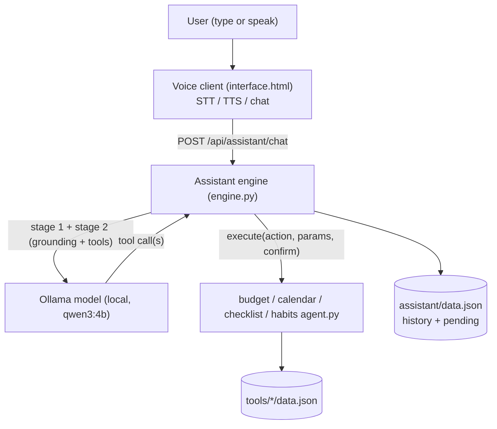

# Assistant Module — Functional Specification

> **Document type:** Functional specification (as built).
> **Runtime:** Ships on a **local Ollama model** (default `llama3.2:3b`, override with
> the `OLLAMA_MODEL` env var) behind a provider-agnostic adapter — any tool-calling
> model could replace it without changing engine behavior. A clean, non-reasoning
> tool-caller is required (see §6); reasoning models (e.g. qwen3.x) leak
> chain-of-thought into replies and hesitate to call destructive tools.
> **Scope:** The assistant is the coordinating layer on top of the suite's four tools —
> **budget, calendar, checklist, habits** — reading their data for context and acting
> through each tool's `agent.py` capability layer. It turns the otherwise independent
> tools into one system the user drives in plain language (typed or spoken).
> **Implementation:** `assistant/engine.py` (backend), `assistant/interface.html` (chat
> UI with STT/TTS), routes in `app.py`.

---

## 1. Overview & Purpose

The assistant is a **natural-language secretary for the business suite**. A user asks
in plain language — "how much did I spend this month", "move my dentist to Friday",
"what's left on my list", "I did my workout today" — and the assistant reads the
relevant tool's data, chooses which capability to invoke, performs the action, and
replies in a short, spoken-quality sentence.

Core design choice: **"the model plans, deterministic tools act."**

- A **local LLM planner** (Ollama) interprets the request and chooses which tool to
  call. It sees a compact, grounded summary of suite state (RAG) plus the
  machine-readable capability manifest each module publishes.
- **Every data change flows through a module's `agent.py` `execute()`**, never through
  text the model writes directly. The tool layer validates parameters and gates
  destructive actions behind a confirmation.

**Design principles.**

- **Provider-agnostic, local-first.** The engine depends only on an abstract
  model-runtime call; the **shipped adapter is Ollama**, running the user's own model on
  their machine. No hosted-vendor lock-in. Swapping models changes nothing but a name.
- **Tool-driven mutations.** All writes run through a module's published `TOOLS` via
  `execute()`; the model may only *propose* a call.
- **Grounded answers (RAG).** Factual replies come from a live, capped snapshot of each
  `data.json`, not from model memory.
- **Confirmed destruction.** Destructive tools never run on a single turn; the assistant
  surfaces the pending action and needs an explicit "yes".
- **Graceful degradation.** If Ollama is unreachable, the turn returns a static help
  reply and the app stays up; reads and the tools' own CLIs still work.
- **Spoken-quality replies.** Every reply is one or two short, plain sentences suitable
  for text-to-speech.

---

## 2. System Context & Actors

| Actor / role | Responsibility |
| :--- | :--- |
| **User** | Types or speaks natural-language requests; reads/hears replies. |
| **Voice client** (`interface.html`) | Browser STT (mic → text) and TTS (reply → speech); renders the chat. |
| **Assistant engine** (`engine.py`) | Orchestrates each turn: resolve confirmation → ground → route → act → reply. |
| **Model runtime** (Ollama, pluggable) | The user's local LLM; interprets the turn and emits tool calls, grounded in supplied context. |
| **Module agents** (`tools/<name>/agent.py`) | Publish capabilities (`describe()`) and execute them (`execute()`). Four: budget, calendar, checklist, habits. |
| **Module stores** (`tools/<name>/data.json`) | Persistent state each agent reads/writes. |
| **Assistant store** (`assistant/data.json`) | Conversation history + single-slot pending confirmation. |

### 2.1 The module-agent contract (the assistant's only tool interface)

Every tool comes from a module `agent.py`; all four expose an **identical shape**, so
the assistant treats them uniformly and discovers tools dynamically:

| Member | Meaning |
| :--- | :--- |
| `describe()` | `{ module, usage_rules, tools }` — the full capability manifest. |
| `TOOLS` | Tool specs: `name`, `description`, `when_to_use`, `parameters` (JSON-Schema), `requires_confirmation`. |
| `execute(action, params, confirm=False)` | Runs one tool by name; returns a result dict; never raises for ordinary errors. |

**Portability requirement.** The engine discovers tools by calling `describe()` on each
registered module — never by hard-coding tool names. A fifth tool following the same
contract becomes available with no engine change.

### 2.2 Component boundary



---

## 3. Processing Pipeline (Behavioral Contract)

Each turn is processed as an ordered sequence (`engine.chat(message)`):

1. **Empty-input guard.** Empty/whitespace → return a short inviting prompt
   (`action="empty"`); nothing else runs.
2. **Record the user turn** to history before processing.
3. **Resolve pending confirmation (first).** If a live pending confirmation exists
   (Section 7) and the text is a yes/no word, resolve it deterministically and return —
   *before* any model call.
4. **Assemble grounding.** Build a compact, capped state summary from the four stores
   (Section 5).
5. **Stage 1 — route or answer.** One model call offering the single `select_module`
   tool. If the model calls it → proceed to stage 2 with that module. If it answers in
   text instead → return that grounded reply (`action="answered"`). If the runtime is
   unreachable → static help (`action="fallback"`).
6. **Stage 2 — act.** A second call offering only the chosen module's tools; run a
   bounded tool-use loop (≤4 hops), dispatching each tool call through the module's
   `execute()` and feeding results back until the model returns a final sentence.
   - Any `needs_confirmation` result **pauses** the turn: store the pending action and
     return a yes/no prompt (`action="needs_confirmation"`).
7. **Reply.** Record the assistant reply and return the response envelope (Section 8).

---

## 4. Two-Stage Routing & Capability Aggregation

The engine defines **no tools of its own**. It reads capabilities from each module's
`describe()` and routes in two stages so a small model never faces all ~29 tools at once.

### 4.1 Stage 1 — module selection

The model is offered exactly one tool:

```
select_module(module: enum["budget","calendar","checklist","habits"])
```

Instruction: call it to **change data** or fetch **exact records**; otherwise just
answer from the grounding summary. This means broad, read-only questions
("how's my month going?") are answered in a single call from grounding, while any write
or precise lookup is routed to one module.

### 4.2 Stage 2 — action selection & execution

The chosen module's `describe()["tools"]` are converted to Ollama function tools
(`when_to_use` folded into the description) and offered alone. The model emits one or
more tool calls; each is dispatched via `module.execute(name, args)` and the result is
appended as a `tool` message. The loop repeats (≤4 hops) so the model can **read before
it writes** (e.g. `list_events` to find an index, then `update_event`).

### 4.3 Tool inventory (⚠️ = destructive, two-step confirm)

| Module | Tools |
| :--- | :--- |
| **budget** | `get_summary`, `list_transactions`, `list_categories`, `limit_status`, `bill_status`, `goal_status`, `spending_breakdown`, `add_transaction`, `add_category`, `set_limit`, `add_bill`, `add_goal`, `contribute_goal`, ⚠️`delete_transaction`, ⚠️`remove_limit`, ⚠️`remove_bill`, ⚠️`remove_goal` |
| **calendar** | `list_events`, `add_event`, `update_event`, ⚠️`delete_event` |
| **checklist** | `list_items`, `add_item`, `set_done`, ⚠️`delete_item` |
| **habits** | `list_habits`, `add_habit`, `mark_complete`, ⚠️`delete_habit` |

### 4.4 Addressing conventions (from each module's `USAGE_RULES`)

- **calendar** and **checklist** act by **index** (from `list_events` / `list_items`
  order). **habits** act by **name** (case-insensitive). **budget** deletes by index;
  limits by category.
- Resolve relative dates ("tomorrow", "next Fri") to absolute `YYYY-MM-DD` before a
  calendar write.
- `priority` is `low`/`med`/`high`, default `med`.

---

## 5. Grounding Context (RAG)

Before routing, the engine reads the four stores and builds a **capped** summary
(`_grounding()`), rebuilt every turn so it reflects earlier writes in the same session:

- **budget:** balance; this month earned/spent/net; categories currently `over` limit;
  bills due soon.
- **calendar:** upcoming events (indexed) — date, time, title, priority.
- **checklist:** open items (indexed) with priority.
- **habits:** each habit with completion count and last-done.

Rules: list lengths are capped (≤10 each); building the summary is **read-only**; the
full stores are never inlined — for detail beyond the cap the model calls a `list_*`
tool in stage 2.

---

## 6. Model Runtime — Ollama Adapter

The runtime is isolated in one function (`_model_chat`) so the provider is swappable.

**Shipped adapter.** `ollama.chat(model, messages, tools, options)` against the local
Ollama daemon.

| Setting | Value |
| :--- | :--- |
| Model | `OLLAMA_MODEL` env var, default `llama3.2:3b`. Must be a **non-reasoning** tool-caller (llama3.2, qwen2.5, mistral). Reasoning models (qwen3.x) are unsuitable — they emit chain-of-thought as reply text and avoid calling destructive tools. |
| Host | Default local daemon; `OLLAMA_HOST` honored by the Ollama client. |
| Determinism | `temperature = 0.1` — favor consistent tool selection. |
| Reasoning | `think=False` requested; a `<think>…</think>` stripper (`_clean`) also guards against models that ignore it. |
| Tools | Function-tool schemas built from each module's `TOOLS`. |
| Routing safety-net | If the model free-texts instead of routing, a deterministic keyword router (`_keyword_route`) forces the correct module so writes are never silently dropped. |
| Streaming | Not used; a single complete message per call. |
| Failure | Any exception (daemon down, timeout) → `_model_chat` returns `None`; the engine falls back to the static help reply. The tool layer, never the model, performs writes. |

**Requirement.** The model may only propose tool calls; it never writes to a store
directly.

---

## 7. Confirmation Flow (Destructive Actions)

Destructive tools (`requires_confirmation`, the ⚠️ rows) use a **two-step** flow the
tool layer enforces. Calling `execute()` without `confirm=True` returns:

```
{ "ok": false, "needs_confirmation": true,
  "message": "'<action>' is destructive. Re-run with confirm=True.",
  "params": { ... } }
```

**Engine behavior.**

- On `needs_confirmation`, store a single-slot pending `{module, action, params, ts}` in
  `assistant/data.json` and return a yes/no prompt naming the target
  (`action="needs_confirmation"`).
- **Next turn, before routing:** an **affirmative** word re-runs
  `execute(..., confirm=True)` (`action="confirmed"`); a **negative** word discards it
  (`action="canceled"`). Resolution is **deterministic** — matched against fixed
  affirmative/negative word lists, never judged by the model.
- **Expiry:** a pending older than **5 minutes** is ignored; a stale yes/no becomes
  ordinary input.
- **Single-slot:** only one pending exists at a time; a new one replaces it.

---

## 8. Response Envelope

`chat()` always returns:

| Field | Meaning |
| :--- | :--- |
| `reply` | Short, spoken-quality sentence for display and TTS. |
| `action` | Outcome code: `empty`, `answered`, `tool_ok`, `needs_confirmation`, `confirmed`, `canceled`, `fallback`. |
| `results` | List of the raw module `execute()` result dict(s) (may be empty). |

Consumers tolerate extra module-specific fields inside `results` and the absence of any.

---

## 9. API Contract

Served by `app.py`; consumed by `interface.html`.

| Method | Path | Body | Response |
| :--- | :--- | :--- | :--- |
| POST | `/api/assistant/chat` | `{ message }` | The response envelope (Section 8). |
| GET | `/api/assistant/history` | query `limit` (default 30) | `{ history: [ { role, message, created_at } … ] }`, oldest-first. |
| POST | `/api/assistant/clear-history` | — | `{ ok: true }` |

The chat UI fragment is served like every tool: `templates/index.html` includes
`assistant/interface.html`, resolved by the Jinja `ChoiceLoader` (which now also sees
the project base dir, since the assistant lives outside `tools/`).

---

## 10. Client Voice Interaction (STT / TTS)

`interface.html` is a self-contained Bootstrap chat fragment.

**Speech input (STT).** `window.SpeechRecognition || webkitSpeechRecognition`,
single-utterance, final-results. On a transcript the text fills the input and is sent.
If unsupported, the mic hides and the user is told to type; a denied mic permission
surfaces a clear message. (Reliable in Chrome/Edge; Firefox support is limited.)

**Turn submission.** Text (typed, Enter, or from speech) is appended as a user bubble;
a "thinking" placeholder shows; the turn is POSTed to `/api/assistant/chat`; the `reply`
replaces the placeholder and is spoken. On network error an apology bubble is shown/spoken.

**Speech output (TTS).** `speechSynthesis.speak()` on each assistant reply, with
markdown characters stripped and a natural voice preferred when available. A mute toggle
cancels in-progress speech; each assistant bubble has a replay control.

**History.** Loaded oldest-first on tab show; a Clear button wipes server history and
resets the chat to a greeting.

---

## 11. Data Model (Logical)

The assistant **owns no domain tables** — each tool remains the source of truth for its
own `data.json` (shapes: budget object; calendar/checklist/habits lists — see each
`agent.py`). The assistant reads them for grounding and writes only via `execute()`.

**assistant/data.json** (new, git-ignored by `**/data.json`):

| Field | Notes |
| :--- | :--- |
| `history[]` | `{ role: "user"\|"assistant", message, created_at }`, ordered. |
| `pending` | Single-slot confirmation `{ module, action, params, ts }`, or `null`. |

---

## 12. Cross-Tool Workflows (The Point of the Assistant)

Each is a short chain of existing tools — no new tool logic.

| User intent | Plan |
| :--- | :--- |
| "How's my month going?" | Answered from grounding in stage 1 (no tool call). |
| "Am I free Friday and can I afford a $200 venue?" | `calendar.list_events(Fri)` + budget summary in grounding → answer; on yes, `add_event` (+ optional `add_transaction`). |
| "Book my dentist Friday 3pm and add a prep task" | `calendar.add_event` → (re-route) `checklist.add_item`. |
| "I finished the tax paperwork" | `checklist.list_items(open)` → `set_done`. |
| "Delete last night's duplicate charge" | `budget.list_transactions` → ⚠️`delete_transaction` (confirm first). |

Chains that include a destructive step pause at that step for confirmation.

---

## 13. Edge Cases & Error Handling

| Situation | Behavior |
| :--- | :--- |
| Empty/whitespace turn | Inviting prompt; `action="empty"`. |
| Ollama unreachable/timeout | Static help reply (`action="fallback"`); app stays up. |
| Model answers without routing | Return its text (`action="answered"`). |
| Unknown action proposed | `execute` → `{ ok:false, error, available }`; surfaced to the user. |
| Bad/missing parameters | `execute` → `{ ok:false, error }`; assistant asks for the detail. |
| Destructive tool proposed | Pause; named yes/no; only run with `confirm=True` next turn. |
| Yes/no with no live pending | Treated as ordinary input. |
| Pending expired (>5 min) | Ignored; treated as ordinary input. |
| Wrong index / name not found | Module returns `{ ok:false, error }`; assistant clarifies. |
| Habit already done today | Once-daily rule makes it a no-op; report it was already logged. |
| Tool-loop exceeds 4 hops | Stop and ask the user to rephrase. |
| STT unsupported / mic denied | Hide mic or show a clear message; text still works. |

**Principle.** Tool-layer failures are returned as data (`ok:false`), never exceptions;
only a dead model runtime triggers the static fallback.

---

## 14. Non-Functional Requirements

- **Provider independence.** One adapter (`_model_chat`); Ollama is swappable.
- **Local-first.** Model and all data run on the user's machine.
- **Deterministic writes & confirmations.** All mutations go through `execute()`;
  yes/no resolution is a fixed word list, not model-judged.
- **Grounded & bounded.** Summaries are capped; full stores never enter model context.
- **Small-model accuracy.** Two-stage routing keeps ≤17 tools per call.
- **Resilience.** Ollama can be down without breaking reads or the tools' CLIs.
- **Extensibility.** New contract-following tools appear via `describe()` with no engine
  change.
- **Auditability.** Every turn is logged; every write is a named tool call with explicit
  parameters.

---

## 15. Assumptions & Portability Notes

- **The model is the user's own, run locally via Ollama.** Default `llama3.2:3b`; any
  non-reasoning tool-capable model works via `OLLAMA_MODEL`. The engine treats the
  runtime as a replaceable adapter.
- **`agent.py` layers are authoritative.** The assistant never bypasses a module to
  touch `data.json` for writes.
- **Headless fallback.** Each `agent.py` also exposes `run_cli()`, so every capability
  can be exercised with no LLM — useful for testing and a degraded, model-less mode.
- **Module differences respected.** Index vs. name addressing, percent vs. fixed limits,
  and the once-daily habit rule are deferred to each module's `USAGE_RULES`.

---

*End of specification.*
