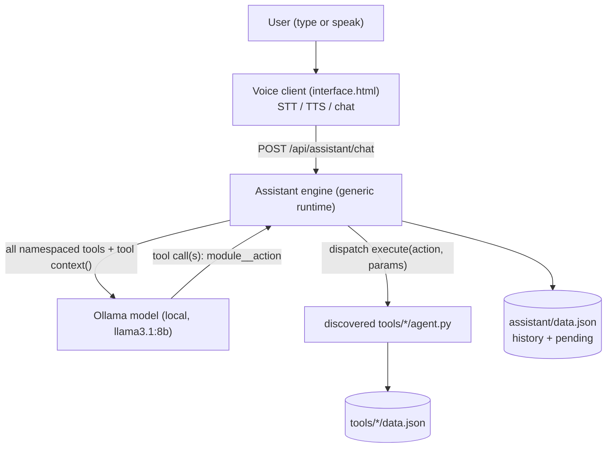

# Assistant Module — Functional Specification

> **Document type:** Functional specification (as built).
> **Runtime:** Ships on a **local Ollama model** (default `llama3.2:3b`, override with
> the `OLLAMA_MODEL` env var) behind a provider-agnostic adapter — any tool-calling
> model could replace it without changing engine behavior. A clean, non-reasoning
> tool-caller is required (see §6); reasoning models (e.g. qwen3.x) leak
> chain-of-thought into replies and hesitate to call destructive tools.
> **Scope:** The assistant is the coordinating layer on top of the suite's four tools —
> **budget, calendar, checklist, habits** — reading their data for context and acting
> through each tool's `agent.py` capability layer. It turns the otherwise independent
> tools into one system the user drives in plain language (typed or spoken).
> **Implementation:** `assistant/engine.py` (backend), `assistant/interface.html` (chat
> UI with STT/TTS), routes in `app.py`.

---

## 1. Overview & Purpose

The assistant is a **generic function-calling runtime**. A user asks in plain language —
"how much did I spend this month", "move my dentist to Friday", "what's left on my
list", "I did my workout today" — and the LLM decides which tool functions to call; the
engine executes them, feeds results back, and the LLM writes the reply.

Core design choice: **the engine knows how to run tools, not what they mean.** All
domain meaning lives in the tools or is decided by the LLM. The engine has **no**
hardcoded module names, routing keywords, overview rules, grounding logic, or date
handling — it discovers tools, presents them, executes calls, handles confirmations, and
keeps sessions.

**Design principles.**

- **Generic runtime.** The engine only: discovers functions, presents them to the LLM,
  executes them, relays results, handles confirmations, and maintains sessions. It never
  encodes what a calendar/checklist/habit/budget is, what "today" means, or which words
  imply which tool.
- **Tools own their meaning.** Each `agent.py` describes its own tools (`description` /
  `when_to_use`), optionally exposes a read-only `context()`, marks writes with
  `mutates`, and validates + previews its own destructive actions.
- **LLM does the semantics.** One call shows the LLM every namespaced tool; it reasons
  about which are relevant ("day overview → events + tasks + habits") and calls them.
- **Provider-agnostic, local-first.** One adapter (`_model_chat`); shipped on a local
  Ollama model (default `llama3.1:latest`). Swapping models changes only a name.
- **Confirmed destruction.** Destructive tools never run on a single turn; the tool
  returns a human preview, the engine gets an explicit yes/no.
- **Graceful degradation.** If the model is unreachable, the turn returns a short help
  reply and the app stays up; the tools' own CLIs still work.

---

## 2. System Context & Actors

| Actor / role | Responsibility |
| :--- | :--- |
| **User** | Types or speaks natural-language requests; reads/hears replies. |
| **Voice client** (`interface.html`) | Browser STT (mic → text) and TTS (reply → speech); renders the chat. |
| **Assistant engine** (`engine.py`) | Generic runtime: discover tools → present all → execute calls → relay results → handle confirmations → keep sessions. |
| **Model runtime** (Ollama, pluggable) | The user's local LLM; decides which tools to call and writes the reply. |
| **Module agents** (`tools/<name>/agent.py`) | Own their meaning: `describe()`, `execute()`, optional `context()`, `mutates` flags, destructive previews. Discovered dynamically. |
| **Module stores** (`tools/<name>/data.json`) | Persistent state each agent reads/writes. |
| **Assistant store** (`assistant/data.json`) | Conversation history + single-slot pending confirmation. |

### 2.1 The module-agent contract (the assistant's only tool interface)

Every tool comes from a module `agent.py`; all four expose an **identical shape**, so
the assistant treats them uniformly and discovers tools dynamically:

| Member | Meaning |
| :--- | :--- |
| `describe()` | `{ module, usage_rules, tools }` — the full capability manifest. |
| `TOOLS` | Tool specs: `name`, `description`, `when_to_use`, `parameters` (JSON-Schema), `requires_confirmation`, `mutates` (writes only). |
| `execute(action, params, confirm=False)` | Runs one tool; returns a result dict; for a destructive call with `confirm=False` it validates the target and returns either an error (missing) or `needs_confirmation` + a human `message`. |
| `context()` *(optional)* | Read-only summary string the engine concatenates into the LLM prompt. The engine never parses it. |

**Discovery.** The engine scans `tools/*/agent.py`, imports each, and flattens all tools
into one **namespaced** set (`module__action`). A new tool folder following this contract
appears to the LLM with **zero engine changes**.

### 2.2 Component boundary



---

## 3. Processing Pipeline (Behavioral Contract)

Each turn is processed as an ordered sequence (`engine.chat_events(message, session_id)`):

1. **Empty-input guard.** Empty/whitespace → short prompt (`action="empty"`).
2. **Record the user turn** to the session before processing.
3. **Resolve pending confirmation (first).** If a live pending confirmation exists
   (Section 7) and the text is a yes/no word, resolve it deterministically and return —
   *before* any model call.
4. **Gather context.** Concatenate each tool's optional `context()` into a read-only
   block (Section 5). The engine does not parse or compute anything domain-specific.
5. **Single function-calling loop.** Build `[system persona + context] + recent history`
   and offer **all** namespaced tools in one call. Loop (≤6 hops):
   - Model returns tool calls → dispatch each `module__action` to
     `MODULES[module].execute(action, params)`, append the result, continue.
   - A `needs_confirmation` result **pauses** the turn: store the pending action and
     return the tool's preview + yes/no prompt (`action="needs_confirmation"`).
   - Model returns no tool calls → that text is the final reply
     (`action="tool_ok"` if any tool ran, else `answered`).
   - Model unreachable → short help reply (`action="fallback"`).
6. **Reply & refresh.** Record the reply; the envelope carries `modules`/`changed`
   (modules with a successful `mutates` call) so the UI refreshes those tabs.

---

## 4. Tool Discovery & Registry

The engine defines **no tools of its own** and hard-codes no module names.

- **Discovery:** scan `tools/*/agent.py`, import each, build `MODULES` dynamically
  (`_discover_modules`). A broken tool is skipped, not fatal.
- **Namespacing:** flatten every module's `describe()["tools"]` into one function-tool
  list named `f"{module}__{action}"`, with a dispatch map `{fullname: (module, action)}`
  and a `mutating` set (from each tool's `mutates` flag). `when_to_use` is folded into
  the description so the LLM has the tool's own semantic hint.
- **One call, all tools.** Every tool is offered to the LLM on every turn; the LLM
  decides which are relevant and may call several across modules in one turn, and read
  before it writes. There is no pre-filtering stage, no routing keywords, no overview
  detector — that intelligence is the LLM's.

Adding `tools/<new>/agent.py` (with `describe`/`execute`, optional `context`, `mutates`)
makes its tools available with **zero engine edits**.

---

## 5. Context (tool-provided, not engine-computed)

The engine calls each module's optional `context()` and concatenates the results under a
"Current context (read-only)" heading. It never inspects the contents. Tools decide what
to surface and own any date logic (e.g. calendar's `context()` states today's date and
lists upcoming events with the index to act on; habits reports today's done status).
This replaces the old engine-side grounding — the engine no longer knows what any store
contains.

---

## 6. Model Runtime — Ollama Adapter

Isolated in one function (`_model_chat`) so the provider is swappable.

| Setting | Value |
| :--- | :--- |
| Model | `OLLAMA_MODEL`, default `llama3.1:latest` (8B). All ~29 tools are shown in one call, so a **capable, non-reasoning** tool-caller is required (llama3.1/qwen2.5/mistral). Avoid reasoning models (qwen3.x): they leak chain-of-thought and dodge destructive tools. |
| Determinism | `temperature = 0.1`. |
| Reasoning | `think=False` + a `<think>…</think>` stripper (`_clean`). |
| Loop bound | ≤6 tool-use hops per turn; if exceeded, one final tool-free call summarizes. |
| Streaming | Not used at the model layer; the HTTP layer streams stage/final events. |
| Failure | Any exception → `_model_chat` returns `None` → short help reply. Tools, never the model, perform writes. |

---

## 7. Confirmation Flow (tool-owned validation)

Destructive tools carry `requires_confirmation`. The **tool** owns validation + the
human preview; the engine is generic. Calling `execute()` with `confirm=False`:

```
target missing  -> { "ok": false, "error": "no <thing> …" }         (no confirmation)
target exists   -> { "ok": false, "needs_confirmation": true,
                     "message": "Delete <human label>? This can't be undone.", "params": {…} }
```

**Engine behavior.**

- On `needs_confirmation`, store a single-slot pending `{module, action, params, ts}` and
  return the tool's `message` + a yes/no prompt (`action="needs_confirmation"`). The
  engine never builds the label — the tool does.
- **Next turn (before the model):** an **affirmative** word re-runs
  `execute(..., confirm=True)` (`action="confirmed"`); a **negative** word discards it
  (`action="canceled"`). Resolution uses fixed yes/no word-lists — the only hardcoded
  words in the engine, and only for confirmation, never routing.
- **Expiry:** a pending older than **5 minutes** is ignored. **Single-slot:** a new one
  replaces any prior.
- Because the tool validates first, the engine never confirms a delete that would fail.

---

## 8. Response Envelope

`chat()` always returns:

| Field | Meaning |
| :--- | :--- |
| `reply` | Short, spoken-quality sentence for display and TTS. |
| `action` | Outcome code: `empty`, `answered`, `tool_ok`, `needs_confirmation`, `confirmed`, `canceled`, `fallback`. |
| `results` | List of the raw module `execute()` result dict(s) across all acted modules (may be empty). |
| `modules` | List of modules acted on this turn (e.g. `["calendar","checklist","habits"]`). |
| `changed` | True if a successful **write** ran — the UI uses this to auto-refresh those tabs. |

Consumers tolerate extra module-specific fields inside `results` and the absence of any.

---

## 9. API Contract

Served by `app.py`; consumed by `interface.html`.

| Method | Path | Body | Response |
| :--- | :--- | :--- | :--- |
| POST | `/api/assistant/chat` | `{ message }` | The response envelope (Section 8). Non-streaming; drains `chat_events()` and returns the final. |
| POST | `/api/assistant/chat/stream` | `{ message }` | **Streamed** newline-delimited JSON (`application/x-ndjson`): zero or more `{ "stage": "<label>" }` progress events, then one `{ "final": <envelope> }`. Message is in the POST body, never the URL. |
| GET | `/api/assistant/history` | query `limit` (30), `session_id` | `{ session_id, history: [ { role, message, created_at } … ] }`, oldest-first. |
| POST | `/api/assistant/clear-history` | `{ session_id }` | `{ ok, session_id }` (clears that session's history). |
| GET | `/api/assistant/sessions` | — | `{ active_id, sessions: [ { id, title, created_at, updated_at, count } … ] }` (newest-updated first). |
| POST | `/api/assistant/sessions` | — | Create a session, make it active: `{ ok, session }`. |
| POST | `/api/assistant/sessions/<id>/activate` | — | `{ ok, active_id }`. |
| POST | `/api/assistant/sessions/<id>/rename` | `{ title }` | `{ ok, session }`. |
| DELETE | `/api/assistant/sessions/<id>` | — | `{ ok, active_id }` (never leaves zero sessions). |

`chat` and `chat/stream` also accept an optional `session_id` in the body; omitted ⇒ the
active session.

**Progress stages** (generic, no domain words): `Reading context` → (`Thinking` ↔
`Calling <module>__<action>`)* → final; a hop-limit turn ends with `Composing reply`;
confirmation turns emit `Confirming action`. The chat UI renders these as a live
timeline instead of a static "thinking".

The chat UI fragment is served like every tool: `templates/index.html` includes
`assistant/interface.html`, resolved by the Jinja `ChoiceLoader` (which now also sees
the project base dir, since the assistant lives outside `tools/`).

---

## 10. Client (sessions, voice, auto-refresh)

`interface.html` is a self-contained Bootstrap fragment: a left **session sidebar** and
the chat on the right.

**Sessions.** The sidebar lists sessions (active highlighted), with **New Chat**, and
per-item **rename** (✎) and **delete** (🗑). Selecting a session activates it and loads
its history; each chat turn carries the active `session_id` and refreshes the list
(titles auto-derive from the first message).

**Speech input (STT).** `window.SpeechRecognition || webkitSpeechRecognition`,
single-utterance, final-results. On a transcript the text fills the input and is sent.
Guards: if unsupported the mic hides; a non-secure origin shows a "use localhost/HTTPS"
message; each error code shows a persistent human message; a transient `network` error
auto-retries once. **Caveat:** browser STT relies on Google's cloud — it works in Chrome
proper but Brave/Edge/Arc and key-stripped Chromium builds always error `network`; the
only fix there is local STT (not implemented).

**Turn submission.** POSTed to `/api/assistant/chat/stream`; the client reads the NDJSON
stream and renders each `stage` as a **live progress timeline** (each stage marks the
previous done ✓ and pulses as current). On `final` the timeline is replaced by the reply
bubble, which is spoken. **Auto-refresh:** if `changed` is true, `window.refreshTab(m)`
(defined in `index.html`) is called for each module in `modules` — it re-fetches that
server-rendered pane and re-executes its scripts, so Calendar/Checklist/Habits/Budget
update without a manual reload.

**Speech output (TTS).** `speechSynthesis.speak()` on each reply, markdown stripped, a
natural voice preferred. A mute toggle cancels in-progress speech; each bubble has a
replay control.

---

## 11. Data Model (Logical)

The assistant **owns no domain tables** — each tool remains the source of truth for its
own `data.json` (shapes: budget object; calendar/checklist/habits lists — see each
`agent.py`). The assistant reads them for grounding and writes only via `execute()`.

**assistant/data.json** (git-ignored by `**/data.json`) — multiple chat sessions:

| Field | Notes |
| :--- | :--- |
| `sessions[]` | `{ id, title, created_at, updated_at, history: [{role, message, created_at}], pending }`. |
| `active_id` | Id of the session used when a request omits `session_id`. |
| `pending` (per session) | Single-slot confirmation `{ module, action, params, ts }`, or `null`. |

An old single-conversation file (`{history, pending}`) is auto-migrated into one session
on first load.

---

## 12. Cross-Tool Workflows (The Point of the Assistant)

Each is a short chain of existing tools — no new tool logic.

| User intent | Plan |
| :--- | :--- |
| "How's my month going?" | LLM calls `budget__get_summary` (+ others it deems relevant). |
| "Am I free Friday and can I afford a $200 venue?" | `calendar.list_events(Fri)` + budget summary in grounding → answer; on yes, `add_event` (+ optional `add_transaction`). |
| "Book my dentist Friday 3pm and add a prep task" | `calendar.add_event` → (re-route) `checklist.add_item`. |
| "I finished the tax paperwork" | `checklist.list_items(open)` → `set_done`. |
| "Delete last night's duplicate charge" | `budget.list_transactions` → ⚠️`delete_transaction` (confirm first). |

Chains that include a destructive step pause at that step for confirmation.

---

## 13. Edge Cases & Error Handling

| Situation | Behavior |
| :--- | :--- |
| Empty/whitespace turn | Inviting prompt; `action="empty"`. |
| Ollama unreachable/timeout | Static help reply (`action="fallback"`); app stays up. |
| Model answers without routing | Return its text (`action="answered"`). |
| Unknown action proposed | `execute` → `{ ok:false, error, available }`; surfaced to the user. |
| Bad/missing parameters | `execute` → `{ ok:false, error }`; assistant asks for the detail. |
| Destructive tool proposed | Pause; named yes/no; only run with `confirm=True` next turn. |
| Yes/no with no live pending | Treated as ordinary input. |
| Pending expired (>5 min) | Ignored; treated as ordinary input. |
| Wrong index / name not found | Module returns `{ ok:false, error }`; assistant clarifies. |
| Habit already done today | Once-daily rule makes it a no-op; report it was already logged. |
| Tool-loop exceeds 4 hops | Stop and ask the user to rephrase. |
| STT unsupported / mic denied | Hide mic or show a clear message; text still works. |

**Principle.** Tool-layer failures are returned as data (`ok:false`), never exceptions;
only a dead model runtime triggers the static fallback.

---

## 14. Non-Functional Requirements

- **Provider independence.** One adapter (`_model_chat`); Ollama is swappable.
- **Local-first.** Model and all data run on the user's machine.
- **Deterministic writes & confirmations.** All mutations go through `execute()`;
  yes/no resolution is a fixed word list, not model-judged.
- **Grounded & bounded.** Summaries are capped; full stores never enter model context.
- **Small-model accuracy.** Two-stage routing keeps ≤17 tools per call.
- **Resilience.** Ollama can be down without breaking reads or the tools' CLIs.
- **Extensibility.** New contract-following tools appear via `describe()` with no engine
  change.
- **Auditability.** Every turn is logged; every write is a named tool call with explicit
  parameters.

---

## 15. Assumptions & Portability Notes

- **The model is the user's own, run locally via Ollama.** Default `llama3.2:3b`; any
  non-reasoning tool-capable model works via `OLLAMA_MODEL`. The engine treats the
  runtime as a replaceable adapter.
- **`agent.py` layers are authoritative.** The assistant never bypasses a module to
  touch `data.json` for writes.
- **Headless fallback.** Each `agent.py` also exposes `run_cli()`, so every capability
  can be exercised with no LLM — useful for testing and a degraded, model-less mode.
- **Module differences respected.** Index vs. name addressing, percent vs. fixed limits,
  and the once-daily habit rule are deferred to each module's `USAGE_RULES`.

---

*End of specification.*
