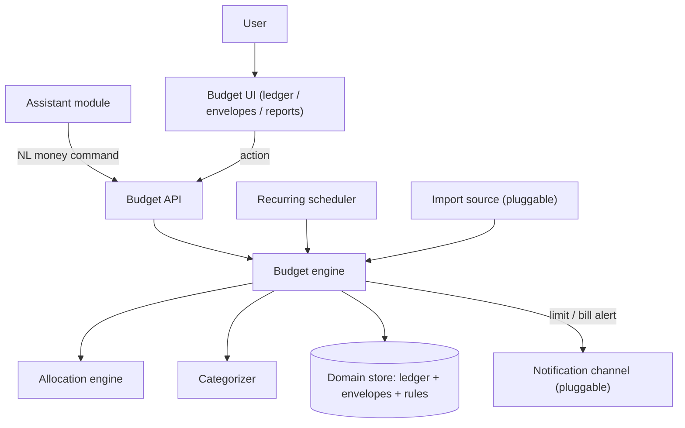
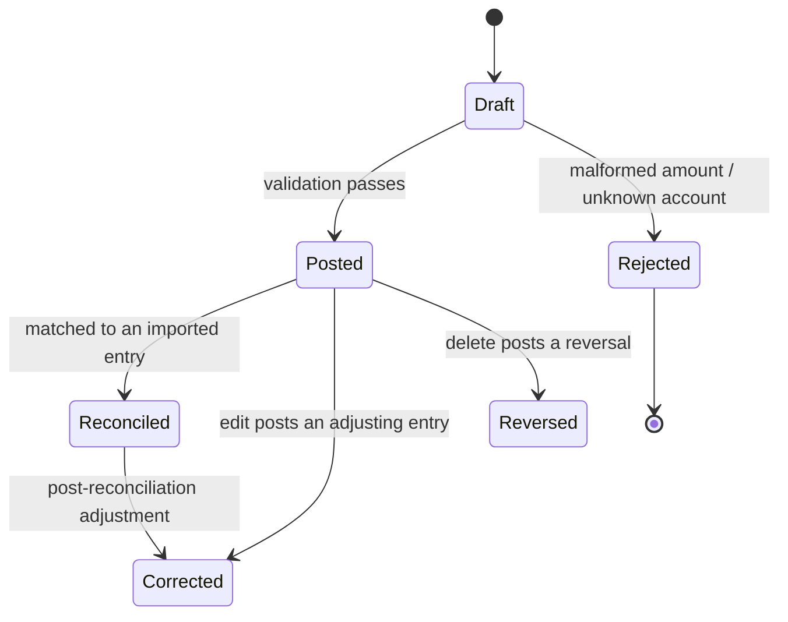
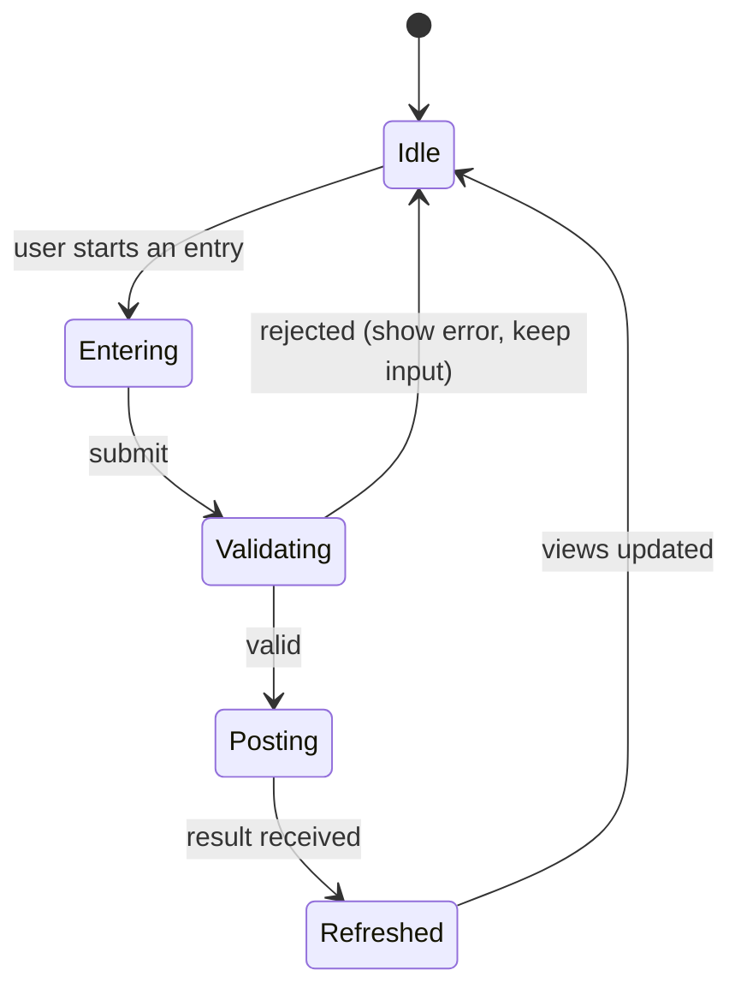

# Budget & Allocation System — Functional Specification

> **Document type:** Abstract external specification (clean-room).
> **Purpose:** Define the observable behavior, contracts, state transitions, and edge
> cases of a local, envelope-based budgeting module, so the
> `custom_business_suite/budget` module can be built from requirements rather than from
> a copy of any reference implementation.
>
> This document describes **what** the system does, not **how** it is coded. It
> contains no source code, pseudo-code, query text, or pattern literals. Anything tied
> to a particular host or provider is called out as an *Implementation note* and should
> be treated as a replaceable adapter, not a requirement.

---

## 1. Overview & Purpose

The system is a **personal budgeting ledger** that answers three questions: *what did I
get* (income/inflows), *what did I pay for* (expenses/outflows), and *where should the
money go* (allocation into envelopes/categories). A user records money movements — by
typing, by natural language through the assistant, or via recurring rules — and the
system keeps running balances, per-envelope remaining amounts, and period reports.

The defining design choice is an **envelope (a.k.a. zero-based) allocation model**:

- Every inflow can be **allocated** across one or more envelopes; every outflow is
  **charged** against exactly one envelope (or split across several).
- An envelope's **remaining** is derived, never stored as a stale number: it is the sum
  of allocations to it minus the sum of charges against it within the active period.
- **Balances** on accounts and **remaining** on envelopes are always recomputed from the
  transaction ledger, so the ledger is the single source of truth.

**Rationale.** Deriving balances from an append-mostly ledger makes the numbers
auditable and reproducible: any total can be re-derived from first principles, and a
correction is just another ledger entry. Storing only rollups would risk drift.

**Design principles (requirements).**

- **Local-first / offline-capable.** Recording, categorizing, allocating, and reporting
  must work with no external network. Bank imports, price lookups, and notifications are
  enhancements whose absence degrades gracefully, never fails hard.
- **Ledger is truth.** Displayed balances and remainings are derived from transactions;
  the system must be able to rebuild every rollup from the ledger alone.
- **Deterministic money math.** Amounts are handled in minor units (integer cents) with
  explicit rounding rules; no floating-point drift in stored figures.
- **Every action produces a plain-language result.** Results are short sentences
  suitable for display or text-to-speech via the assistant.
- **Non-destructive corrections.** Edits and deletes are recorded; a reversal is
  preferred to silent mutation for reconciled entries.

---

## 2. System Context & Actors

### 2.1 Actors and external roles

| Actor / role | Responsibility |
| :--- | :--- |
| **User** | Records income/expenses, defines envelopes and budgets, reads reports. |
| **Budget engine** | Orchestrates each action: validate → post to ledger → re-derive rollups → check limits → reply. |
| **Allocation engine** | Applies allocation rules that split an inflow across envelopes, and resolves which envelope an outflow is charged to. |
| **Categorizer** | Infers an envelope/category for an uncategorized transaction from its description. |
| **Domain store** | Persistent record of accounts, transactions, envelopes, period budgets, recurring rules, and allocation rules. |
| **Recurring scheduler** (pluggable) | Materializes due recurring transactions and reminders on a cadence. |
| **Notification channel(s)** (pluggable) | Delivers overspend/limit and bill-due alerts to an outside destination. |
| **Import source** (pluggable, optional) | Supplies external transactions (bank/CSV) for reconciliation. |
| **Assistant module** (peer) | Sends natural-language money commands and reads summaries for grounding. |

### 2.2 Pluggable interfaces (portability requirement)

- **Notification interface** — "given a formatted alert and a target channel, deliver it
  and report which channels succeeded." Implementation note: shares the suite's
  messaging adapters used by the assistant.
- **Import interface** — "produce a batch of external transactions with date, amount,
  and description." Implementation note: CSV/bank adapters are optional; the module is
  fully usable with manual entry only.
- **Scheduler interface** — "invoke a callback when a recurring rule or reminder is
  due." Implementation note: may be shared with the assistant's background scheduler.
- **Clock interface** — "current date/time and active period boundary." Implementation
  note: swappable to make period math and tests deterministic.

### 2.3 Component boundary (informational)

---

## 3. Processing Pipeline (Behavioral Contract)

Each money action is processed as an ordered sequence. Ordering is a requirement
because rollups and limit checks depend on a fully-posted ledger.

1. **Validation guard.** The request is checked for a well-formed amount (parseable to a
   positive minor-unit integer), a known or inferable envelope, and a valid account.
   Malformed input is rejected with an explanatory error; nothing is posted.
2. **Normalization.** Amount is parsed to minor units; description is trimmed; date
   defaults to the clock's "today" if omitted; type (inflow/outflow/transfer) is
   resolved.
3. **Categorization / allocation.** For an outflow with no envelope, the categorizer
   infers one from the description (Section 6.3). For an inflow, the allocation engine
   applies matching allocation rules to split it across envelopes (Section 6.4); an
   unallocated remainder lands in a default "unallocated" envelope.
4. **Ledger post.** One or more ledger entries are appended atomically (a split posts
   multiple lines that sum to the transaction total). The ledger is append-mostly:
   corrections are new entries, not silent overwrites of reconciled ones.
5. **Rollup re-derivation.** Affected account balances and envelope remainings are
   recomputed from the ledger for the active period.
6. **Limit check & alerts.** If a charge pushes an envelope past its period budget (or
   an account below a configured floor), an alert result is produced and, if a channel
   is configured, dispatched.
7. **Reply.** A short, plain-language result is returned (and recorded for the assistant
   transcript when the action originated there).

**Result envelope (contract).** Every action returns an object containing at minimum:

| Field | Meaning |
| :--- | :--- |
| `reply` | Human-readable, TTS-friendly sentence describing the outcome. |
| `action` | Short machine code naming the outcome (e.g. "expense_posted", "income_allocated", "over_budget"). Drives client refresh. |
| `transactions` | The ledger entries created/affected (possibly empty). |
| `envelopes` | The envelope records whose remaining changed (possibly empty). |

Consumers must tolerate extra fields and the absence of action-specific ones.

---

## 4. Operation Catalog

Operations the module recognizes, whether issued via UI actions or parsed from assistant
natural language. When parsed from language, entries are tested top-to-bottom and the
first match wins; more specific intents precede general ones.

| # | Operation | Recognized meaning (example phrasing) | Extracted parameters | Side effect | Returned `action` |
| :-- | :--- | :--- | :--- | :--- | :--- |
| 0 | **Confirm-Yes / No** | Affirmative/negative **only when a pending confirmation is active** (e.g. create-missing-envelope offer) | (pending context) | Executes or discards the pending action | `confirmed` / `canceled` |
| 1 | **Record-Expense** | "I spent 20 on groceries", "paid 60 for gas" | amount, description, envelope?, account? | Posts an outflow charged to an envelope | `expense_posted` |
| 2 | **Record-Income** | "got paid 500", "add 500 paycheck" | amount, source, account? | Posts an inflow; applies allocation rules | `income_allocated` |
| 3 | **Transfer** | "move 100 from checking to savings" | amount, from-account, to-account | Posts a paired transfer (no net change) | `transferred` |
| 4 | **Allocate / Move-Money** | "move 50 from dining to groceries" | amount, from-envelope, to-envelope | Re-allocates budgeted money between envelopes | `reallocated` |
| 5 | **Create-Envelope** | "make an envelope called Travel" | name, budget?, period? | Creates an envelope if new | `envelope_created` |
| 6 | **Set-Budget** | "budget 300 a month for groceries" | envelope, amount, period | Sets/updates a period limit | `budget_set` |
| 7 | **Delete-Envelope** | "delete the Travel envelope" | envelope | Deletes envelope; its ledger lines move to unallocated | `envelope_deleted` |
| 8 | **Add-Recurring** | "I pay 15 for streaming every month" | amount, description, envelope, cadence, next-date | Creates a recurring rule | `recurring_created` |
| 9 | **List-Recurring** | "what bills are coming up" | window? | Reads upcoming materializations | `recurring_listed` |
| 10 | **Envelope-Remaining** | "how much is left in dining" | envelope | Reads derived remaining for active period | `remaining` |
| 11 | **Account-Balance** | "what's my checking balance" | account | Reads derived account balance | `balance` |
| 12 | **Spending-Report** | "what did I spend this month", "spending by category" | period, group-by? | Aggregates outflows | `report` |
| 13 | **List-Transactions** | "show recent transactions" | filter?, limit? | Reads a capped ledger slice | `transactions_listed` |
| 14 | **Edit-Transaction** | "change that to 25" | target, new-fields | Posts a correction to a prior entry | `transaction_edited` |
| 15 | **Delete-Transaction** | "delete that expense" | target | Reverses/removes a ledger entry | `transaction_deleted` |
| 16 | **Split-Transaction** | "split 90: 60 groceries, 30 household" | total, parts[] | Posts multiple lines summing to total | `expense_posted` |

**Precedence notes (behavioral requirements).**

- Pending-confirmation handling is checked **first**, and only when a pending context
  exists; otherwise a bare "yes"/"no" is ordinary input.
- Transfer and envelope-to-envelope Allocate are tested **before** plain Expense/Income
  so "move" verbs are not misread as spending.
- Set-Budget is distinguished from Record-Expense by budgeting language ("budget",
  "per month", "a month for") vs. spending language ("spent", "paid").
- Handlers reject amounts that do not parse to a positive value and descriptions that are
  empty or begin with a question word.

---

## 5. State & Lifecycle

### 5.1 Pending confirmation (single-slot)

Mirrors the assistant's short-lived confirmation model. Set when a handler ends with a
yes/no question — chiefly the **create-missing-envelope offer** (charging to an unknown
envelope) and the **large-purchase-to-checklist offer**. Resolved on the next turn
(affirmative executes, negative discards) and cleared immediately. Honored only within a
short expiry window (reference: **5 minutes**); a stale context is ignored.

### 5.2 Transaction lifecycle

### 5.3 Budget period lifecycle

A period (default **monthly**) has an open window during which charges accrue against
envelope budgets. At period close, each envelope's leftover is handled by its
**rollover policy** (Section 6.6): carry-forward, reset-to-zero, or return-to-unallocated.
A new period opens with fresh derived remainings.

---

## 6. Domain Behaviors

### 6.1 Amount & currency parsing

- Accepts digits, currency symbols, thousands separators, and spelled magnitudes
  ("twenty", "a hundred", "1.5k").
- Parses to **minor units (integer cents)**; a single configured display currency is
  assumed (multi-currency is out of scope, flagged in Section 13).
- Negative or zero amounts are rejected for expense/income; sign is implied by
  transaction type, not entered by the user.
- Rounding is explicit and half-up on any derived division (e.g. even splits).

### 6.2 Description normalization

- Trim surrounding punctuation; strip leading fillers ("for", "on", "a", "the").
- Preserve the merchant/description substring for categorizer keyword matching.

### 6.3 Envelope auto-categorization

- When an outflow has no envelope, one is **inferred from keywords** in the description
  (groceries, dining, gas/transport, utilities, rent, entertainment, health, etc.),
  defaulting to a general "misc" envelope.
- Each envelope carries a representative **icon** by keyword, with a generic default.
- A default seed set of envelopes is created on first initialization.
- Envelopes referenced by ledger lines but never explicitly created are
  **auto-registered** when envelopes are listed, keeping the catalog consistent.

### 6.4 Allocation rules (inflow splitting)

- An **allocation rule** maps an income source (or "any income") to a set of envelope
  weights, expressed as fixed amounts and/or percentages.
- On an inflow, matching rules split the amount across envelopes; fixed amounts are
  satisfied first, then percentages apply to the remainder; any leftover goes to
  **unallocated**.
- With no matching rule, the whole inflow lands in unallocated for the user to
  distribute later.

### 6.5 Remaining & balance derivation

- **Envelope remaining** (active period) = allocations-in − charges-out, computed from
  the ledger; never read from a stored counter.
- **Account balance** = inflows − outflows ± transfers for that account across all time.
- Both are recomputed after every post; a full rebuild from the ledger must reproduce
  identical figures.

### 6.6 Rollover policies

Per-envelope, one of: **carry-forward** (leftover adds to next period's budget),
**reset** (leftover discarded, budget starts fresh), or **return** (leftover flows back
to unallocated). Overspent envelopes may optionally **carry the deficit** forward.

### 6.7 Recurring materialization

- A recurring rule binds an amount, description, envelope, cadence (daily/weekly/monthly/
  yearly or a day-of-month), and a next-due date.
- The scheduler materializes due rules into real ledger entries and advances the
  next-due date, suppressing duplicate materialization for the same due date.
- Upcoming (not-yet-due) rules are readable as a forecast without posting.

### 6.8 Split transactions

- A split posts multiple ledger lines that **must sum exactly** to the stated total;
  a mismatch is rejected. Each line carries its own envelope.

### 6.9 Import & reconciliation (optional)

- Imported entries are matched to existing ledger entries by near-equal amount and close
  date; matches are marked reconciled, unmatched imports become new entries pending
  categorization. Import never overwrites a reconciled entry silently.

---

## 7. Assistant Integration

The budget module is a first-class tool set for the suite assistant, per the README's
"sync together using the assistant."

**Natural-language intents surfaced to the assistant.** The assistant routes money
phrasings to the operations in Section 4. Representative mappings:

| User says (to assistant) | Budget operation | Reply shape |
| :--- | :--- | :--- |
| "I spent 20 on groceries" | Record-Expense | "Logged $20 to Groceries; $180 left this month." |
| "add my 500 paycheck" | Record-Income | "Added $500 income; allocated per your rules." |
| "how much is left in dining" | Envelope-Remaining | "$45 left in Dining this month." |
| "what did I spend this month" | Spending-Report | "You've spent $1,240 this month; top: Rent." |
| "move 50 from dining to groceries" | Allocate | "Moved $50 from Dining to Groceries." |

**Grounding summary provided to the assistant model.** On request the module supplies a
compact context: active-period name, each envelope with budget and remaining, top
spending categories, and account balances — capped in size (never the full ledger),
matching the assistant's small-context RAG contract.

**Cross-module sync (requirements).**

- **Recurring bills → Calendar.** Each recurring rule can surface as a calendar
  agenda item / reminder on its next-due date (Calendar module, its Assistant-integration
  section).
- **Large-purchase → Checklist / lists.** An over-threshold planned purchase can be
  offered (via the pending confirmation) as a checklist or shopping-list item.
- **Alerts → Notification.** Over-budget and low-balance alerts reuse the suite's shared
  notification channels.

Mutations are always driven by the deterministic budget engine; the assistant model
produces only conversational text and never posts to the ledger directly.

---

## 8. API Contract

All endpoints are served by the application backend under `/api/budget`. Paths and
shapes below are the contract the client and assistant depend on.

### 8.1 Ledger & accounts

| Method | Path | Purpose | Key request fields | Key response fields |
| :--- | :--- | :--- | :--- | :--- |
| GET | `/api/budget/transactions` | List/search ledger | query: `from?`, `to?`, `envelope?`, `account?`, `limit?` | `transactions`, `count` |
| POST | `/api/budget/transactions` | Post an income/expense/transfer/split | `type`, `amount`, `description?`, `envelope?`, `account?`, `date?`, `splits?` | `transactions`, `envelopes` |
| PATCH | `/api/budget/transactions/<id>` | Correct an entry | changed fields | `transaction` |
| DELETE | `/api/budget/transactions/<id>` | Reverse/remove an entry | — | `success` |
| GET | `/api/budget/accounts` | List accounts with derived balances | — | `accounts`, `count` |
| POST | `/api/budget/accounts` | Create an account | `name`, `type?`, `opening_balance?` | `account` |

### 8.2 Envelopes, budgets, rules, reports

| Method | Path | Purpose | Key request fields | Key response fields |
| :--- | :--- | :--- | :--- | :--- |
| GET | `/api/budget/envelopes` | List envelopes with budget + remaining | query: `period?` | `envelopes`, `count` |
| POST | `/api/budget/envelopes` | Create an envelope | `name`, `icon?`, `budget?`, `period?`, `rollover?` | `envelope` |
| PATCH | `/api/budget/envelopes/<name>` | Update budget/rollover/icon | changed fields | `envelope` |
| DELETE | `/api/budget/envelopes/<name>` | Delete envelope (lines → unallocated) | — | `moved_lines` |
| POST | `/api/budget/envelopes/reallocate` | Move budgeted money between envelopes | `from`, `to`, `amount` | `envelopes` |
| GET | `/api/budget/rules` | List allocation rules | — | `rules` |
| POST | `/api/budget/rules` | Create allocation rule | `source`, `weights[]` | `rule` |
| GET | `/api/budget/recurring` | List recurring rules / forecast | query: `window?` | `recurring`, `count` |
| POST | `/api/budget/recurring` | Create recurring rule | `amount`, `description`, `envelope`, `cadence`, `next_date` | `recurring` |
| DELETE | `/api/budget/recurring/<id>` | Delete a recurring rule | — | `success` |
| GET | `/api/budget/reports/spending` | Spending report | query: `from?`, `to?`, `group_by?` | `total`, `groups[]` |
| GET | `/api/budget/summary` | Compact grounding summary for the assistant | query: `period?` | `period`, `envelopes[]`, `accounts[]`, `top_categories[]` |

**Validation & status expectations.** Missing/malformed required fields (unparseable
amount, unknown account, split that doesn't sum) yield a client-error status with an
`error` message and `success: false`. Successful mutating calls return `success: true`.

**Authentication (context).** Endpoints sit behind the suite's session gate and return
an unauthorized status without a valid session; the auth mechanism is out of scope.

---

## 9. Data Model (Logical)

Types are descriptive; name comparisons are case-insensitive; money is stored in minor
units (integer cents).

**Accounts** — one row per money container.

| Field | Type | Notes |
| :--- | :--- | :--- |
| id | identifier | primary key |
| name | text | unique, case-insensitive |
| type | text | checking / savings / cash / credit |
| opening_balance | integer | minor units; part of balance derivation |
| created_at | timestamp | |

**Transactions (ledger lines)** — append-mostly.

| Field | Type | Notes |
| :--- | :--- | :--- |
| id | identifier | primary key |
| type | text | inflow / outflow / transfer |
| amount | integer | minor units; always positive, sign implied by type |
| account_id | identifier | source/holding account |
| counter_account_id | identifier | for transfers only |
| envelope | text | charged/allocated envelope (null for transfers) |
| description | text | merchant/source text |
| group_id | identifier | ties split lines / reversals to their origin |
| status | text | posted / reconciled / reversed |
| date | date | effective date |
| created_at / updated_at | timestamps | maintained on write |

**Envelopes** — budget buckets.

| Field | Type | Notes |
| :--- | :--- | :--- |
| id | identifier | primary key |
| name | text | unique, case-insensitive |
| icon | text | representative glyph |
| budget | integer | period limit in minor units (nullable) |
| period | text | monthly / weekly / yearly |
| rollover | text | carry / reset / return |
| created_at | timestamp | |

**Allocation rules** — inflow splitting.

| Field | Type | Notes |
| :--- | :--- | :--- |
| id | identifier | primary key |
| source | text | income source or "any" |
| weights | list | envelope → fixed amount and/or percent |

**Recurring rules** — scheduled transactions.

| Field | Type | Notes |
| :--- | :--- | :--- |
| id | identifier | primary key |
| amount | integer | minor units |
| description | text | |
| envelope | text | target envelope |
| cadence | text | daily / weekly / monthly / yearly / day-of-month |
| next_date | date | next materialization |
| last_run | timestamp | duplicate-fire suppression |
| enabled | flag | on/off |

**Pending context** — single-slot conversational state (Section 5.1): keyed record with
a serialized payload and an update timestamp used for expiry.

---

## 10. Client / UI Interaction

**Primary views.**

- **Ledger** — reverse-chronological transaction list with quick-add and inline edit.
- **Envelopes** — per-envelope budget vs. remaining bars for the active period, with
  reallocate controls.
- **Reports** — spending by category and income-vs-expense for a chosen period.
- **Recurring** — upcoming bills/forecast.

**Quick-add flow (UI state machine).**

**Post-action data refresh.** When a result's `action` indicates data changed
(expense_posted, income_allocated, reallocated, budget_set, envelope_created/deleted,
transaction_edited/deleted), the client refreshes ledger, envelope, and report views so
the UI matches the derived rollups.

**Assistant-originated actions.** Money commands entered through the assistant produce
the same results and trigger the same refresh signals, so both surfaces stay consistent.

---

## 11. Edge Cases & Error Handling

| Situation | Required behavior |
| :--- | :--- |
| Unparseable / zero / negative amount | Reject with an explanatory error; post nothing. |
| Split that does not sum to the total | Reject the whole split; post nothing. |
| Expense to an unknown envelope | Charge to inferred envelope, or open a create-envelope confirmation. |
| Income with no matching allocation rule | Land the full amount in "unallocated"; report it. |
| Envelope deleted with existing ledger lines | Move those lines to "unallocated"; never orphan history. |
| Overspent envelope | Post the charge, return an `over_budget` result, alert if a channel is configured. |
| Transfer between the same account | Reject as a no-op. |
| Recurring rule due multiple times before a run | Materialize each missed occurrence once; suppress duplicates via `last_run`. |
| Edit/delete of a reconciled entry | Prefer an adjusting/reversal entry over silent mutation; record the change. |
| Import matches nothing | Create pending, uncategorized entries; never overwrite reconciled data. |
| Notification channel not configured | Report the alert inline; do not fail the post. |
| Period boundary crossed | Apply each envelope's rollover policy; open the new period with fresh remainings. |
| Missing required API fields | Return a client-error status with an explanatory message. |

**General principle:** external-dependency failures degrade gracefully to a useful
result; only malformed input or a non-summing split is rejected outright.

---

## 12. Non-Functional Requirements

- **Local-first / offline core.** Recording, allocation, derivation, and reporting work
  with no external connectivity.
- **Auditable & reproducible.** Every balance and remaining is re-derivable from the
  ledger; a full rebuild reproduces identical figures.
- **Exact money math.** Minor-unit integers with explicit rounding; no floating-point in
  stored values.
- **Low latency.** Posting and rollup re-derivation for a normal ledger size feel
  instantaneous.
- **Determinism split.** Ledger operations are deterministic; only the assistant's
  conversational layer is probabilistic, and it never mutates the ledger.
- **Resilience.** Any single external dependency (notifier, importer, scheduler) can be
  down without breaking core budgeting.
- **Concurrency.** The API serves simultaneous requests; the recurring scheduler runs
  independently of request handling.

---

## 13. Assumptions & Portability Notes

- **Single display currency.** Multi-currency and FX are out of scope; a currency field
  is assumed constant. A future extension would attach currency per account and convert
  in reports.
- **Notification, import, and scheduler providers are replaceable** via their interfaces
  (Section 2.2); concrete adapters are shared with the rest of the suite.
- **Clock is injectable.** Period math and recurring materialization depend only on the
  clock interface so behavior is deterministic and testable.
- **Envelope vs. category.** "Envelope" and "category" are used interchangeably; the
  module keeps an alias-normalization table so assistant phrasings map to canonical
  envelope names, mirroring the assistant module's canonical-list handling.
- **Host coupling is out of scope.** Session auth and any host-specific concerns are
  provided by the surrounding suite, not by the budget contract.

---

*End of specification.*
