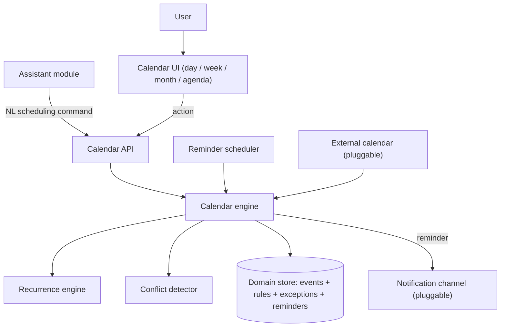
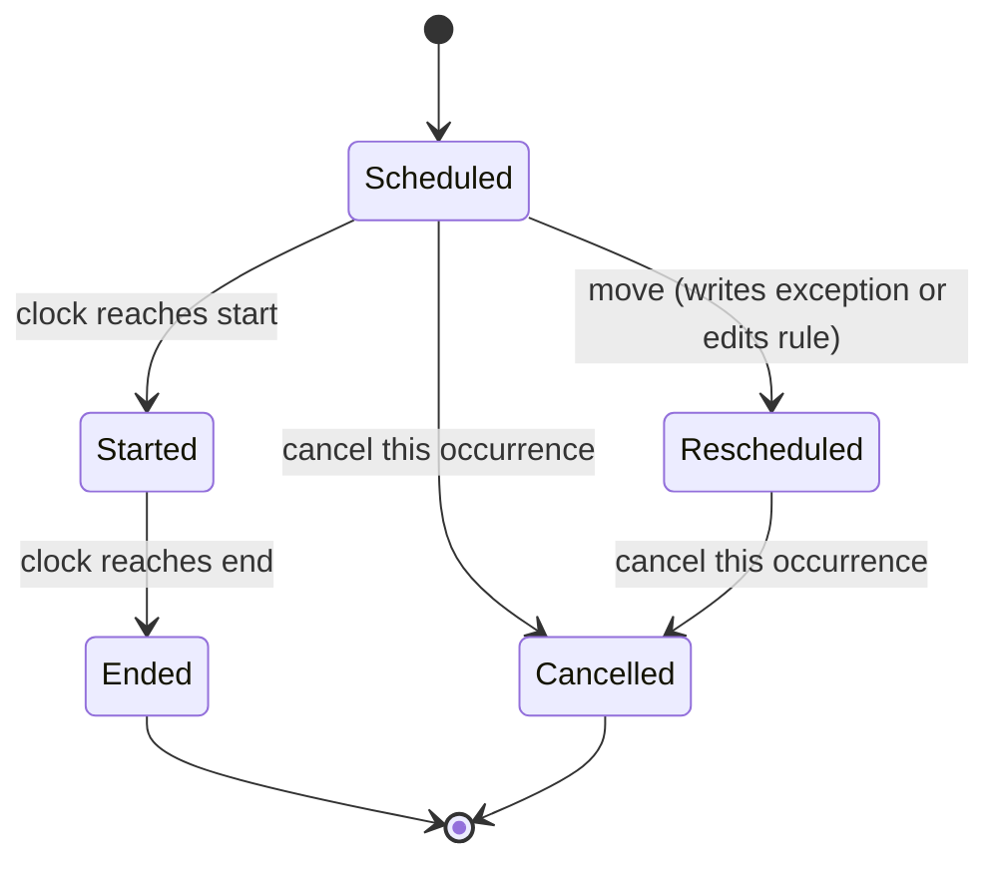
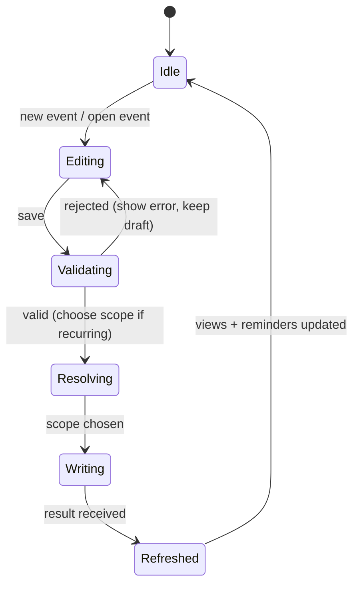

# Calendar & Scheduling System — Functional Specification

> **Document type:** Abstract external specification (clean-room).
> **Purpose:** Define the observable behavior, contracts, state transitions, and edge
> cases of a local calendar/scheduling module, so the
> `custom_business_suite/calendar` module can be built from requirements rather than from
> a copy of any reference implementation.
>
> This document describes **what** the system does, not **how** it is coded. It
> contains no source code, pseudo-code, query text, or pattern literals. Anything tied
> to a particular host or provider is called out as an *Implementation note* and should
> be treated as a replaceable adapter, not a requirement.

---

## 1. Overview & Purpose

The system is a **personal calendar** for tracking days and everything to be done
throughout them: timed events, all-day events, and reminders. A user creates and edits
events — by typing, by natural language through the assistant, or via recurrence rules —
and the system renders day/week/month/agenda views, expands recurring series, detects
conflicts, and fires reminders on time.

The defining design choice is a **rule-plus-instance recurrence model**:

- A recurring event is stored **once as a rule** (start, duration, recurrence pattern,
  optional end/count) rather than as many copies.
- Concrete **occurrences** are **expanded on demand** for a requested date window, with
  per-occurrence **exceptions** (a moved or cancelled single instance) layered on top.
- This keeps storage compact and edits coherent: "change the series" edits the rule,
  "change just this one" writes an exception.

**Rationale.** Materializing every occurrence would bloat storage and make series edits
error-prone. On-demand expansion within a bounded window is fast, and the exception
layer gives precise single-instance control without duplicating the series.

**Design principles (requirements).**

- **Local-first / offline-capable.** Creating, editing, viewing, and expanding events
  must work with no external network. External calendar sync and push notifications are
  enhancements whose absence degrades gracefully.
- **Deterministic time math.** Occurrence expansion, conflict detection, and reminder
  timing are exact and reproducible given the same inputs and clock.
- **Every action produces a plain-language result.** Results are short sentences
  suitable for display or text-to-speech via the assistant.
- **Time-zone explicit.** Every stored instant carries an explicit zone; display honors
  the user's active zone and DST transitions.

---

## 2. System Context & Actors

### 2.1 Actors and external roles

| Actor / role | Responsibility |
| :--- | :--- |
| **User** | Creates/edits events, sets reminders, browses days. |
| **Calendar engine** | Orchestrates each action: validate → normalize time → write rule/instance → reply. |
| **Recurrence engine** | Expands rules into occurrences for a window; applies exceptions. |
| **Conflict detector** | Reports overlaps among timed occurrences. |
| **Reminder scheduler** (pluggable) | Fires due reminders and dispatches them. |
| **Domain store** | Persistent record of calendars, events, recurrence rules, exceptions, reminders. |
| **Notification channel(s)** (pluggable) | Delivers reminders to an outside destination. |
| **External calendar source** (pluggable, optional) | Imports/exports events (e.g. iCal feed). |
| **Assistant module** (peer) | Sends natural-language scheduling commands and reads the agenda for grounding. |

### 2.2 Pluggable interfaces (portability requirement)

- **Reminder-scheduler interface** — "invoke a callback when a reminder becomes due."
  Implementation note: may be the assistant's shared background scheduler
  (`assistant/output.md` §7.11), checking on a cadence with minute granularity and
  suppressing duplicate fires.
- **Notification interface** — "given a formatted reminder and a target channel, deliver
  it and report which channels succeeded." Shares the suite's messaging adapters.
- **External-calendar interface** — "supply/accept a batch of events in a portable
  format." Implementation note: iCal import/export is optional.
- **Clock & zone interface** — "current instant and active time zone." Swappable to make
  expansion, conflict, and reminder timing deterministic and testable.

### 2.3 Component boundary (informational)

---

## 3. Processing Pipeline (Behavioral Contract)

Each calendar action is processed as an ordered sequence. Ordering is a requirement
because expansion and conflict checks depend on a normalized, stored event.

1. **Validation guard.** The request is checked for a resolvable date/time, a
   non-negative duration, and (for edits) an existing target. Malformed input is
   rejected with an explanatory error; nothing is written.
2. **Time normalization.** Natural-language or partial dates are resolved to explicit
   zoned instants (Section 6.1); an omitted end is derived from a default duration;
   all-day vs. timed is decided (Section 6.2).
3. **Series vs. single resolution.** For a recurring target, the action's scope (this
   occurrence / this-and-future / whole series) determines whether the rule is edited or
   an exception is written (Section 6.4).
4. **Write.** The event, rule, or exception is persisted atomically.
5. **Reminder (re)scheduling.** Any reminders attached to the event are (re)registered
   with the scheduler at their computed lead times.
6. **Conflict annotation.** Affected occurrences in the touched window are checked for
   overlaps; conflicts are reported but never block the write (soft warning).
7. **Reply.** A short, plain-language result is returned (and recorded for the assistant
   transcript when the action originated there).

**Result envelope (contract).** Every action returns an object containing at minimum:

| Field | Meaning |
| :--- | :--- |
| `reply` | Human-readable, TTS-friendly sentence describing the outcome. |
| `action` | Short machine code naming the outcome (e.g. "event_created", "event_moved", "agenda_listed"). Drives client refresh. |
| `events` | The occurrence/event records relevant to the reply (possibly empty). |
| `conflicts` | Overlapping occurrences detected, if any (possibly empty). |

Consumers must tolerate extra fields and the absence of action-specific ones.

---

## 4. Operation Catalog

Operations the module recognizes, whether from UI actions or parsed from assistant
natural language. When parsed, entries are tested top-to-bottom and the first match
wins; more specific intents precede general ones.

| # | Operation | Recognized meaning (example phrasing) | Extracted parameters | Side effect | Returned `action` |
| :-- | :--- | :--- | :--- | :--- | :--- |
| 0 | **Confirm-Yes / No** | Affirmative/negative **only when a pending confirmation is active** (e.g. conflict-override offer) | (pending context) | Executes or discards the pending action | `confirmed` / `canceled` |
| 1 | **Create-Event** | "schedule dentist tomorrow 3pm", "meeting Friday 10-11" | title, start, end/duration, calendar? | Creates a single event | `event_created` |
| 2 | **Create-Recurring** | "gym every weekday 7am", "rent on the 1st monthly" | title, start, pattern, end/count? | Creates a recurrence rule | `recurring_created` |
| 3 | **Create-All-Day** | "vacation next Monday to Friday" | title, date range | Creates an all-day event | `event_created` |
| 4 | **Move / Reschedule** | "move the dentist to Thursday 4pm" | target, new-time, scope | Edits event or writes an exception | `event_moved` |
| 5 | **Edit-Details** | "rename standup to sync", "add a note" | target, changed-fields, scope | Updates event/rule | `event_edited` |
| 6 | **Cancel-Occurrence** | "cancel tomorrow's standup" | target, single occurrence | Writes a cancellation exception | `occurrence_cancelled` |
| 7 | **Delete-Series** | "delete the gym series" | target series | Removes the rule and its exceptions | `series_deleted` |
| 8 | **Add-Reminder** | "remind me 30 min before" | target, lead time, channel? | Attaches a reminder | `reminder_added` |
| 9 | **List-Reminders** | "what reminders are set" | window? | Reads attached reminders | `reminders_listed` |
| 10 | **Agenda / What's-On** | "what's on today", "anything Tuesday" | date/window | Expands + reads occurrences | `agenda_listed` |
| 11 | **Next-Event** | "what's my next thing" | — | Reads the soonest upcoming occurrence | `next_event` |
| 12 | **Find-Free** | "when am I free Thursday afternoon" | window, duration | Computes open gaps between occurrences | `free_slots` |
| 13 | **Search-Events** | "find my dentist appointment" | text query | Searches titles/notes | `events_found` / `not_found` |
| 14 | **List-Calendars** | "what calendars do I have" | — | Reads calendars with counts | `calendars_listed` |
| 15 | **Create-Calendar** | "make a Work calendar" | name, color? | Creates a calendar if new | `calendar_created` |

**Precedence notes (behavioral requirements).**

- Pending-confirmation handling is checked **first**, and only when a pending context
  exists (chiefly the conflict-override offer).
- Create-Recurring is tested **before** Create-Event so recurrence words ("every",
  "each", "weekly", "on the Nth") are not misread as a one-off.
- Move/Edit against a recurring target must carry a **scope** (this / this-and-future /
  all); absent an explicit scope, the default is "this occurrence" and the user is told
  which scope was applied.
- Handlers reject titles that are empty or begin with a question word, and times that do
  not resolve to a concrete instant.

---

## 5. State & Lifecycle

### 5.1 Pending confirmation (single-slot)

Mirrors the assistant's short-lived confirmation model. Set when a handler ends with a
yes/no question — chiefly the **conflict-override offer** ("that overlaps another event —
add it anyway?") and the **delete-whole-series offer**. Resolved on the next turn and
cleared immediately; honored only within a short expiry window (reference: **5 minutes**).

### 5.2 Event/occurrence lifecycle

### 5.3 Reminder lifecycle

A reminder is **pending** until its computed fire time (event start minus lead), then
**fired** (dispatched to channels, stamped to suppress duplicates), then inert. Moving
or cancelling the event re-computes or clears pending reminders.

---

## 6. Domain Behaviors

### 6.1 Natural-language date/time parsing

- Resolves relative dates ("today", "tomorrow", "next Friday", "in 2 hours"), clock
  times ("3pm", "15:00", "half past nine"), and ranges ("10-11", "2 to 4").
- Anchors relative expressions to the clock's "now" in the active zone.
- An omitted end applies a **default duration** (reference: 60 minutes for timed
  events); an omitted time on a dated event may make it **all-day**.
- Ambiguous or unresolvable expressions are rejected with a clarifying message rather
  than a guessed instant.

### 6.2 All-day vs. timed

- All-day events span whole calendar days in the active zone and are ordered above timed
  events in day/agenda views.
- Timed events carry explicit zoned start/end; duration is end − start.

### 6.3 Recurrence expansion

- A rule encodes frequency (daily/weekly/monthly/yearly), interval, by-day/by-month-day
  qualifiers, and an optional until-date or occurrence count.
- Occurrences are **expanded on demand for a requested window only**, never
  materialized wholesale.
- **Exceptions** layer over the expansion: a moved occurrence replaces the computed one
  at its slot; a cancelled occurrence is omitted.

### 6.4 Series-scope edits

- Edits to a recurring event carry a scope:
  - **this occurrence** → write/replace an exception for that date.
  - **this and future** → split the rule (end the old rule the day before, create a new
    rule from the change forward).
  - **whole series** → edit the rule in place.

### 6.5 Conflict detection

- Two timed occurrences **conflict** when their intervals overlap on the same day.
- Conflicts are reported as soft warnings; the write still succeeds (optionally behind
  the conflict-override confirmation for assistant-driven creates).

### 6.6 Free/busy computation

- Given a window and a target duration, the module returns open gaps between busy
  (timed, non-cancelled) occurrences, honoring an optional working-hours bound.

### 6.7 Reminder timing

- A reminder's fire time = occurrence start − lead. For recurring events, each expanded
  occurrence yields its own reminder.
- The scheduler checks due reminders on a cadence (minute granularity), dispatches to
  bound channels, and stamps a last-fire to suppress duplicates within the same minute.

### 6.8 Time-zone & DST handling

- Stored instants are zoned; display converts to the active zone.
- Across a DST transition, wall-clock recurring times are preserved (a "9am daily"
  stays 9am local), and durations remain constant in real time.

---

## 7. Assistant Integration

The calendar module is a first-class tool set for the suite assistant, per the README's
"sync together using the assistant."

**Natural-language intents surfaced to the assistant.** The assistant routes scheduling
phrasings to the operations in Section 4. Representative mappings:

| User says (to assistant) | Calendar operation | Reply shape |
| :--- | :--- | :--- |
| "schedule dentist tomorrow 3pm" | Create-Event | "Added Dentist tomorrow at 3:00 PM." |
| "what's on today" | Agenda | "3 things today: standup 9, lunch 12, dentist 3." |
| "move the dentist to Thursday" | Move | "Moved Dentist to Thursday 3:00 PM." |
| "remind me 30 min before" | Add-Reminder | "You'll be reminded 30 minutes before." |
| "when am I free Thursday afternoon" | Find-Free | "You're free 1-2:30 and after 4." |

**Grounding summary provided to the assistant model.** On request the module supplies a
compact context: today's and the next few days' occurrences (title, time), plus counts —
capped in size (never the full history), matching the assistant's small-context RAG
contract.

**Cross-module sync (requirements).**

- **Checklist due dates → Calendar agenda.** Tasks with due dates appear as agenda items
  on their due day (read-through; the checklist remains the owner). See Checklist module.
- **Habit cadence → Calendar agenda.** A habit's daily/weekly cadence surfaces as a
  recurring agenda marker so "what's on today" includes habits. See Habits module.
- **Budget recurring bills → Calendar reminders.** A budget recurring rule can surface as
  a reminder on its next-due date. See Budget module.
- **Assistant reminders bind here.** The assistant's "remind me" flows create calendar
  reminders through this module rather than a separate store.

Mutations are always driven by the deterministic calendar engine; the assistant model
produces only conversational text and never writes events directly.

---

## 8. API Contract

All endpoints are served by the application backend under `/api/calendar`. Paths and
shapes below are the contract the client and assistant depend on.

### 8.1 Events & occurrences

| Method | Path | Purpose | Key request fields | Key response fields |
| :--- | :--- | :--- | :--- | :--- |
| GET | `/api/calendar/events` | List/expand occurrences in a window | query: `from`, `to`, `calendar?`, `search?` | `events`, `count` |
| POST | `/api/calendar/events` | Create single/all-day/recurring event | `title`, `start`, `end?`/`duration?`, `all_day?`, `recurrence?`, `calendar?`, `reminders?` | `events` |
| PATCH | `/api/calendar/events/<id>` | Edit/move an event or occurrence | changed fields + `scope` | `events` |
| DELETE | `/api/calendar/events/<id>` | Delete event/series | query: `scope?` | `success` |
| GET | `/api/calendar/agenda` | Agenda for a day/window | query: `date?`, `days?` | `events`, `count` |
| GET | `/api/calendar/next` | Soonest upcoming occurrence | — | `event` |
| GET | `/api/calendar/free` | Free/busy gaps | query: `from`, `to`, `duration?` | `slots` |

### 8.2 Calendars & reminders

| Method | Path | Purpose | Key request fields | Key response fields |
| :--- | :--- | :--- | :--- | :--- |
| GET | `/api/calendar/calendars` | List calendars with counts | — | `calendars`, `count` |
| POST | `/api/calendar/calendars` | Create a calendar | `name`, `color?` | `calendar` |
| DELETE | `/api/calendar/calendars/<name>` | Delete a calendar and its events | — | `deleted_events` |
| GET | `/api/calendar/reminders` | List reminders in a window | query: `from?`, `to?` | `reminders`, `count` |
| POST | `/api/calendar/events/<id>/reminders` | Attach a reminder | `lead`, `channel?` | `reminder` |
| DELETE | `/api/calendar/reminders/<id>` | Remove a reminder | — | `success` |
| GET | `/api/calendar/summary` | Compact grounding summary for the assistant | query: `days?` | `today[]`, `upcoming[]`, `counts` |

**Validation & status expectations.** Missing/malformed required fields (unresolvable
time, missing title, negative duration, recurring edit without scope) yield a
client-error status with an `error` message and `success: false`. Successful mutating
calls return `success: true`.

**Authentication (context).** Endpoints sit behind the suite's session gate and return
an unauthorized status without a valid session; the auth mechanism is out of scope.

---

## 9. Data Model (Logical)

Types are descriptive; text comparisons are case-insensitive; instants are stored with an
explicit zone offset.

**Calendars** — grouping/color for events.

| Field | Type | Notes |
| :--- | :--- | :--- |
| id | identifier | primary key |
| name | text | unique, case-insensitive |
| color | text | display color |
| created_at | timestamp | |

**Events** — a single event or the master of a series.

| Field | Type | Notes |
| :--- | :--- | :--- |
| id | identifier | primary key |
| calendar | text | owning calendar |
| title | text | required |
| notes | text | optional |
| start | timestamp+zone | required |
| end | timestamp+zone | required (derived if omitted) |
| all_day | flag | whole-day span |
| created_at / updated_at | timestamps | maintained on write |

**Recurrence rules** — one per recurring series (attached to its master event).

| Field | Type | Notes |
| :--- | :--- | :--- |
| id | identifier | primary key |
| event_id | identifier | master event |
| frequency | text | daily / weekly / monthly / yearly |
| interval | integer | every N units |
| by_day / by_monthday | list | qualifiers |
| until / count | date / integer | series bound (nullable) |

**Occurrence exceptions** — single-instance overrides.

| Field | Type | Notes |
| :--- | :--- | :--- |
| id | identifier | primary key |
| rule_id | identifier | owning series |
| occurrence_date | date | the slot overridden |
| kind | text | moved / cancelled |
| new_start / new_end | timestamp+zone | for moved (nullable) |

**Reminders** — lead-time alerts on an event.

| Field | Type | Notes |
| :--- | :--- | :--- |
| id | identifier | primary key |
| event_id | identifier | target event |
| lead | duration | before start |
| channel | text | target channel(s) |
| last_fired | timestamp | duplicate-fire suppression |
| enabled | flag | on/off |

**Pending context** — single-slot conversational state (Section 5.1): keyed record with a
serialized payload and an update timestamp used for expiry.

---

## 10. Client / UI Interaction

**Primary views.**

- **Day** — hour grid with timed events and an all-day band.
- **Week** — seven day-columns with overlap layout.
- **Month** — date cells with event chips and overflow indicators.
- **Agenda** — flat chronological list (the view the assistant reads/echoes).

**Create/edit flow (UI state machine).**

**Post-action data refresh.** When a result's `action` indicates data changed
(event_created/edited/moved, occurrence_cancelled, series_deleted, reminder_added,
calendar_created/deleted), the client re-expands the visible window and refreshes agenda
and reminder views.

**Conflict surfacing.** When a write returns `conflicts`, the UI highlights the
overlapping occurrences; assistant-driven creates may route through the conflict-override
confirmation before committing.

---

## 11. Edge Cases & Error Handling

| Situation | Required behavior |
| :--- | :--- |
| Unresolvable / ambiguous date-time | Reject with a clarifying message; write nothing. |
| End before start / negative duration | Reject with an explanatory error. |
| Recurring edit without a scope | Default to "this occurrence" and state the applied scope. |
| Overlapping events | Report as a soft conflict; still write (or offer override via confirmation). |
| Move of a single occurrence | Write a moved exception; leave the rest of the series intact. |
| Delete of a series vs. one occurrence | Honor `scope`; deleting the series removes its exceptions too. |
| DST transition within a recurring series | Preserve wall-clock time; keep real durations constant. |
| Reminder for a past occurrence | Do not fire retroactively; mark inert. |
| Duplicate reminder fire within the same minute | Suppressed via the last-fired stamp. |
| Reminder channel not configured | Report the reminder inline; do not fail the write. |
| Search matches nothing | State that no event was found; offer to create it. |
| Calendar deleted with events | Delete its events (or reassign, per configuration); never orphan events. |
| Missing required API fields | Return a client-error status with an explanatory message. |

**General principle:** external-dependency failures degrade gracefully to a useful
result; only malformed or unresolvable input is rejected outright.

---

## 12. Non-Functional Requirements

- **Local-first / offline core.** Create, edit, view, expand, and remind work with no
  external connectivity.
- **Deterministic expansion.** Given the same rules, exceptions, window, and clock,
  occurrence lists and free/busy gaps are reproducible.
- **Low latency.** Windowed expansion and agenda rendering feel instantaneous for a
  normal event volume.
- **Bounded work.** Recurrence is expanded per requested window, never materialized in
  full; long/open-ended series stay cheap.
- **Determinism split.** Calendar operations are deterministic; only the assistant's
  conversational layer is probabilistic, and it never writes events.
- **Resilience.** Any single external dependency (notifier, scheduler, external
  calendar) can be down without breaking core scheduling.
- **Concurrency.** The API serves simultaneous requests; the reminder scheduler runs
  independently of request handling.

---

## 13. Assumptions & Portability Notes

- **Single active user/zone.** Multi-user sharing and invitations are out of scope; a
  single active time zone is assumed, injectable via the clock/zone interface.
- **Recurrence subset.** The rule model targets common patterns (daily/weekly/monthly/
  yearly with interval and by-day/by-month-day); exotic rules are out of scope and would
  extend the rule fields without changing the expansion contract.
- **Notification, scheduler, and external-calendar providers are replaceable** via their
  interfaces (Section 2.2); concrete adapters are shared with the rest of the suite.
- **Reminder scheduler may be shared** with the assistant's background scheduler; the
  calendar depends only on the abstract scheduler interface.
- **Host coupling is out of scope.** Session auth and host-specific concerns are provided
  by the surrounding suite, not by the calendar contract.

---

*End of specification.*
