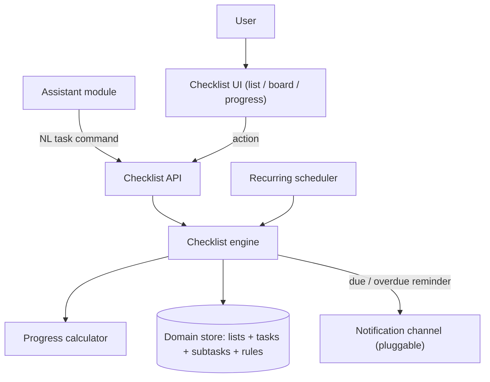
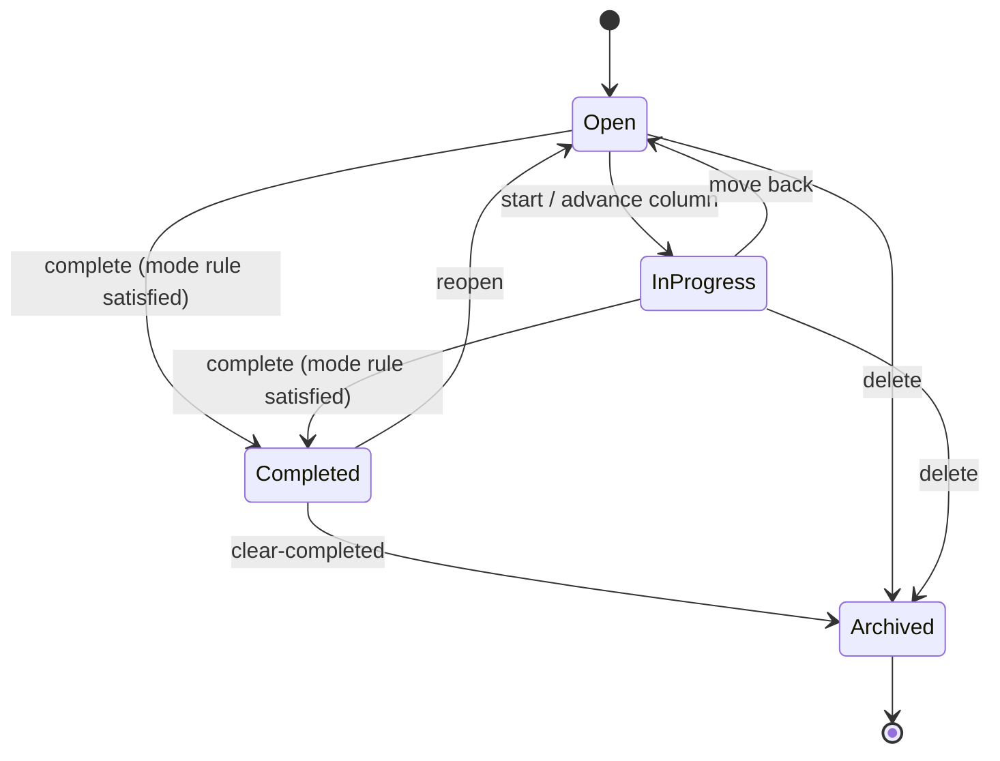
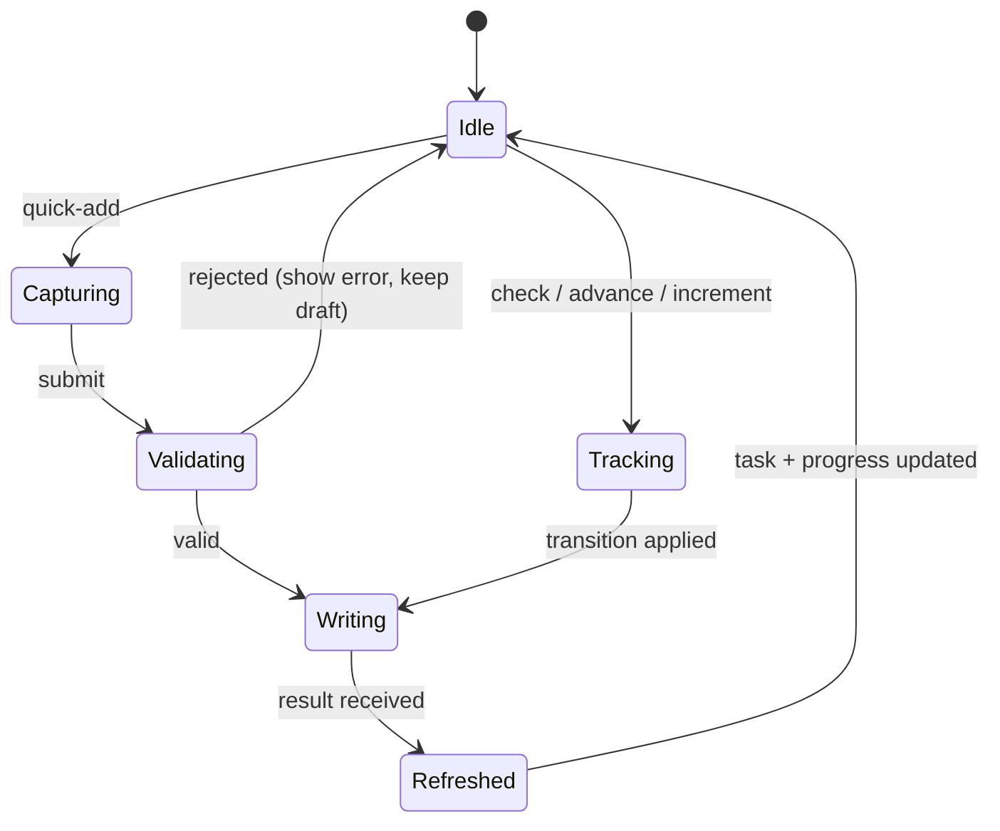

# Checklist & To-Do System — Functional Specification

> **Document type:** Abstract external specification (clean-room).
> **Purpose:** Define the observable behavior, contracts, state transitions, and edge
> cases of a local to-do/checklist module, so the
> `custom_business_suite/checklist` module can be built from requirements rather than from
> a copy of any reference implementation.
>
> This document describes **what** the system does, not **how** it is coded. It
> contains no source code, pseudo-code, query text, or pattern literals. Anything tied
> to a particular host or provider is called out as an *Implementation note* and should
> be treated as a replaceable adapter, not a requirement.

---

## 1. Overview & Purpose

The system is a **personal task manager** — a to-do list with **multiple distinct forms
of tracking**. A user captures tasks — by typing, by natural language through the
assistant, or via recurring rules — organizes them into lists/projects, and tracks
progress in whichever mode fits: a simple checkbox, a subtask-driven percentage, a
count/quota, or a kanban board of states.

The defining design choice is a **per-task tracking mode**:

- Every task declares a **tracking mode** that determines what "done" means and how
  progress is computed and displayed.
- The four modes — **checkbox**, **subtasks/percent**, **count/quota**, **kanban** — share
  one task record but expose different completion semantics (Section 6.2).
- A task's **completion** is always **derived** from its mode's rule (e.g. subtasks-done
  ÷ subtasks-total), never a free-floating flag that can disagree with its parts.

**Rationale.** Different work needs different tracking: a one-off errand is a checkbox, a
multi-step project is a percentage, a "drink 8 glasses" goal is a count, and a workflow
is a board. Encoding the mode on the task keeps one coherent model while letting each
task behave correctly, and deriving completion prevents a parent from claiming "done"
while subtasks remain open.

**Design principles (requirements).**

- **Local-first / offline-capable.** Capture, organize, track, and complete must work
  with no external network. Notifications and cross-module surfacing are enhancements
  whose absence degrades gracefully.
- **Derived completion.** A task's done-state and progress follow from its tracking
  mode's rule; parents never contradict their subtasks.
- **Deterministic operations.** State transitions, progress rollups, and recurring
  regeneration are exact and reproducible.
- **Every action produces a plain-language result.** Results are short sentences suitable
  for display or text-to-speech via the assistant.
- **Non-destructive completion.** Completing archives rather than erases; history stays
  queryable.

---

## 2. System Context & Actors

### 2.1 Actors and external roles

| Actor / role | Responsibility |
| :--- | :--- |
| **User** | Captures tasks, organizes lists, tracks and completes work. |
| **Checklist engine** | Orchestrates each action: validate → apply mode rule → transition → derive progress → reply. |
| **Progress calculator** | Derives task/list completion from the task's tracking mode and its parts. |
| **Domain store** | Persistent record of lists, tasks, subtasks, tags, and recurring rules. |
| **Recurring scheduler** (pluggable) | Regenerates recurring tasks on their cadence. |
| **Notification channel(s)** (pluggable) | Delivers due/overdue reminders to an outside destination. |
| **Assistant module** (peer) | Sends natural-language task commands and reads open work for grounding. |

### 2.2 Pluggable interfaces (portability requirement)

- **Recurring-scheduler interface** — "invoke a callback when a recurring task is due to
  regenerate." Implementation note: may be the assistant's shared background scheduler.
- **Notification interface** — "given a formatted reminder and a target channel, deliver
  it and report which channels succeeded." Shares the suite's messaging adapters.
- **Clock interface** — "current date/time." Swappable so due-date math and recurring
  regeneration are deterministic and testable.

### 2.3 Component boundary (informational)

---

## 3. Processing Pipeline (Behavioral Contract)

Each task action is processed as an ordered sequence. Ordering is a requirement because
progress rollups depend on a fully-applied state change.

1. **Validation guard.** The request is checked for a non-empty title (on create) or an
   existing target (on update), a known list, and a mode-appropriate payload (e.g. a
   count target for count mode). Malformed input is rejected; nothing is written.
2. **Normalization.** Title is trimmed; natural-language due dates are resolved to
   concrete dates (Section 6.1); tracking mode and its parameters are resolved
   (Section 6.2); list defaults to an inbox when omitted.
3. **State transition.** The requested transition is applied under the task's mode rule
   (check, advance kanban column, adjust count, toggle a subtask). Illegal transitions
   are rejected (Section 5.2).
4. **Write.** The task/subtask/list change is persisted atomically.
5. **Progress rollup.** The task's derived completion is recomputed, then its parent
   list's aggregate progress; a mode's completion may cascade (all subtasks done → parent
   complete).
6. **Recurrence handling.** Completing a recurring task schedules/creates its next
   occurrence per the rule (Section 6.5).
7. **Reply.** A short, plain-language result is returned (and recorded for the assistant
   transcript when the action originated there).

**Result envelope (contract).** Every action returns an object containing at minimum:

| Field | Meaning |
| :--- | :--- |
| `reply` | Human-readable, TTS-friendly sentence describing the outcome. |
| `action` | Short machine code naming the outcome (e.g. "task_added", "task_completed", "list_progress"). Drives client refresh. |
| `tasks` | The task/subtask records relevant to the reply (possibly empty). |
| `progress` | Derived completion for the affected task/list (possibly absent). |

Consumers must tolerate extra fields and the absence of action-specific ones.

---

## 4. Operation Catalog

Operations the module recognizes, whether from UI actions or parsed from assistant
natural language. When parsed, entries are tested top-to-bottom and the first match
wins; more specific intents precede general ones.

| # | Operation | Recognized meaning (example phrasing) | Extracted parameters | Side effect | Returned `action` |
| :-- | :--- | :--- | :--- | :--- | :--- |
| 0 | **Confirm-Yes / No** | Affirmative/negative **only when a pending confirmation is active** (e.g. clear-completed offer) | (pending context) | Executes or discards the pending action | `confirmed` / `canceled` |
| 1 | **Add-Task** | "add buy milk to my todo", "remind me to call Sam Friday" | title, list?, due?, priority?, mode? | Creates a task | `task_added` |
| 2 | **Add-Recurring-Task** | "water plants every 3 days" | title, cadence, list? | Creates a recurring rule + first task | `recurring_created` |
| 3 | **Add-Subtask** | "under Website add 'write copy'" | parent, title | Adds a subtask to a parent | `subtask_added` |
| 4 | **Complete-Task** | "mark X done", "finished the report" | target | Completes/archives (mode-dependent) | `task_completed` |
| 5 | **Uncomplete-Task** | "reopen X" | target | Returns a completed task to open | `task_reopened` |
| 6 | **Advance-State** | "move X to in progress" | target, column | Transitions a kanban task's column | `task_moved` |
| 7 | **Increment-Count** | "log one more glass of water" | target, amount? | Raises a count-mode task's tally | `count_updated` |
| 8 | **Set-Due** | "make X due Friday" | target, date | Sets/changes a due date | `due_set` |
| 9 | **Set-Priority** | "mark X high priority" | target, priority | Sets priority | `priority_set` |
| 10 | **Tag-Task** | "tag X as errand" | target, tag | Adds/removes a tag | `tagged` |
| 11 | **Move-Task** | "move X to the Work list" | target, list | Reassigns a task to another list | `task_moved_list` |
| 12 | **Edit-Task** | "rename X to Y", "add a note" | target, changed-fields | Updates task fields | `task_edited` |
| 13 | **Delete-Task** | "delete X" | target | Removes a task (and its subtasks) | `task_deleted` |
| 14 | **Create-List** | "make a Groceries list" | name, mode? | Creates a list if new | `list_created` |
| 15 | **Clear-Completed** | "clear finished tasks in Work" | list? | Archives all completed in scope | `completed_cleared` |
| 16 | **Show-List** | "what's in my Work list" | list | Reads tasks in a list | `list_listed` |
| 17 | **Whats-Due** | "what's due this week", "anything overdue" | window | Reads tasks by due window | `due_listed` |
| 18 | **List-Progress** | "how's the Website project" | list | Reads derived list progress | `list_progress` |
| 19 | **List-All-Lists** | "what lists do I have" | — | Reads lists with counts + progress | `lists_listed` |

**Precedence notes (behavioral requirements).**

- Pending-confirmation handling is checked **first**, and only when a pending context
  exists (chiefly the clear-completed / delete-list offers).
- Add-Recurring-Task is tested **before** Add-Task so recurrence words ("every", "each",
  "daily") are not misread as a one-off title.
- Increment-Count and Advance-State are tested **before** Complete-Task so
  count/kanban tasks are progressed correctly rather than force-completed.
- Handlers reject titles that are empty or begin with a question word, and mode-specific
  operations against a task whose mode doesn't support them (e.g. increment on a checkbox
  task) with a clear message.

---

## 5. State & Lifecycle

### 5.1 Pending confirmation (single-slot)

Mirrors the assistant's short-lived confirmation model. Set when a handler ends with a
yes/no question — chiefly **clear-completed** and **delete-list** offers. Resolved on the
next turn and cleared immediately; honored only within a short expiry window (reference:
**5 minutes**).

### 5.2 Task state machine

The generic lifecycle; kanban mode exposes intermediate columns explicitly.

**Legal-transition rules.** Completion is permitted only when the task's **mode rule** is
satisfiable by the action (e.g. checking a checkbox, filling a count to target, marking
the final subtask). A kanban task "completes" by reaching its terminal column.

### 5.3 Recurring task lifecycle

A recurring rule owns a template; completing the current occurrence **generates the next**
at the rule's cadence (fixed interval, or relative to completion date — Section 6.5).
Deleting the rule stops regeneration; existing generated tasks remain.

---

## 6. Domain Behaviors

### 6.1 Title & due-date normalization

- Trim surrounding punctuation; strip leading fillers ("to", "remember to", "a", "the").
- Resolve natural-language due dates ("today", "tomorrow", "Friday", "in 3 days") to
  concrete dates against the clock; unresolvable dates are left unset with a note rather
  than guessed.

### 6.2 Tracking modes (completion semantics)

| Mode | "Done" means | Progress display |
| :--- | :--- | :--- |
| **Checkbox** | The single checkbox is checked. | done / not done |
| **Subtasks / percent** | All subtasks are complete. | completed ÷ total subtasks |
| **Count / quota** | The tally reaches the target (e.g. 8 of 8). | current ÷ target |
| **Kanban** | The task reaches the terminal column (e.g. "Done"). | column position |

- A list may declare a **default mode** applied to new tasks; a task may override it.
- Switching a task's mode re-derives its completion under the new rule (e.g. checkbox →
  subtasks recomputes from any subtasks present).

### 6.3 Progress rollup

- **Task completion** is derived from its mode rule (never a stale flag).
- **List progress** aggregates its tasks (reference: completed-count ÷ active-count, with
  count/percent tasks contributing fractional completion).
- Rollups recompute after every write so displayed progress matches the parts.

### 6.4 Priority & ordering

- Priority is an ordered set (e.g. none/low/medium/high). Default sort within a list is
  by state, then priority, then due date, then creation order; the user may pin a manual
  order (drag), which overrides the default sort.

### 6.5 Recurring regeneration

- A recurring rule regenerates either on a **fixed schedule** (every Monday) or
  **relative to completion** (3 days after done), configurable per rule.
- Regeneration creates the next task and, for scheduled rules, may generate a missed
  occurrence once; duplicate generation for the same slot is suppressed.

### 6.6 Overdue & reminders

- A task is **overdue** when its due date is past and it is not completed.
- Optional reminders fire at a lead time before the due date via the scheduler and
  notification channel, with duplicate-fire suppression.

### 6.7 Search & filter

- Tasks are searchable by title/notes substring and filterable by list, tag, priority,
  state, and due window; results honor the active sort.

---

## 7. Assistant Integration

The checklist module is a first-class tool set for the suite assistant, per the README's
"sync together using the assistant."

**Natural-language intents surfaced to the assistant.** The assistant routes task
phrasings to the operations in Section 4. Representative mappings:

| User says (to assistant) | Checklist operation | Reply shape |
| :--- | :--- | :--- |
| "add buy milk to my todo" | Add-Task | "Added 'buy milk' to your To-Do list." |
| "mark the report done" | Complete-Task | "Marked 'report' done; Work is 80% complete." |
| "what's due this week" | Whats-Due | "3 due this week: report Wed, taxes Fri, call Sat." |
| "log one more glass of water" | Increment-Count | "Water: 6 of 8 today." |
| "how's the Website project" | List-Progress | "Website is 60% — 3 of 5 tasks done." |

**Grounding summary provided to the assistant model.** On request the module supplies a
compact context: open tasks due soon (title, list, due), per-list progress, and counts —
capped in size (never the full history), matching the assistant's small-context RAG
contract.

**Cross-module sync (requirements).**

- **Due dates → Calendar.** Tasks with due dates surface as calendar agenda items on
  their due day (the checklist remains the owner; the calendar reads through). See
  Calendar module.
- **Recurring dailies ↔ Habits.** A daily recurring task overlaps the habit model; a
  task may be promoted to a habit, and habit completion may satisfy a mirrored daily task
  (Section, Habits module).
- **Shopping-type lists ↔ Assistant / Budget.** A shopping/grocery checklist can share
  items with the assistant's shopping list and inform budget planned-purchase flows.

Mutations are always driven by the deterministic checklist engine; the assistant model
produces only conversational text and never writes tasks directly.

---

## 8. API Contract

All endpoints are served by the application backend under `/api/checklist`. Paths and
shapes below are the contract the client and assistant depend on.

### 8.1 Lists

| Method | Path | Purpose | Key request fields | Key response fields |
| :--- | :--- | :--- | :--- | :--- |
| GET | `/api/checklist/lists` | List lists with counts + progress | — | `lists`, `count` |
| POST | `/api/checklist/lists` | Create a list | `name`, `mode?`, `icon?` | `list` |
| PATCH | `/api/checklist/lists/<name>` | Update name/mode/icon | changed fields | `list` |
| DELETE | `/api/checklist/lists/<name>` | Delete a list and its tasks | — | `deleted_tasks` |
| POST | `/api/checklist/lists/<name>/clear-completed` | Archive completed tasks | — | `cleared_count` |
| GET | `/api/checklist/lists/<name>/progress` | Derived list progress | — | `progress`, `done`, `total` |

### 8.2 Tasks & subtasks

| Method | Path | Purpose | Key request fields | Key response fields |
| :--- | :--- | :--- | :--- | :--- |
| GET | `/api/checklist/tasks` | List/search/filter tasks | query: `list?`, `tag?`, `state?`, `due_from?`, `due_to?`, `search?` | `tasks`, `count` |
| POST | `/api/checklist/tasks` | Create a task | `title`, `list?`, `due?`, `priority?`, `mode?`, `count_target?`, `recurrence?` | `task` |
| PATCH | `/api/checklist/tasks/<id>` | Edit/transition a task | changed fields (`state?`, `column?`, `count?`, `due?`, `priority?`, `list?`, `title?`) | `task`, `progress` |
| DELETE | `/api/checklist/tasks/<id>` | Delete a task and its subtasks | — | `success` |
| POST | `/api/checklist/tasks/<id>/complete` | Complete/archive under mode rule | — | `task`, `progress` |
| POST | `/api/checklist/tasks/<id>/subtasks` | Add a subtask | `title` | `subtask`, `progress` |
| PATCH | `/api/checklist/subtasks/<id>` | Toggle/edit a subtask | `done?`, `title?` | `subtask`, `progress` |
| DELETE | `/api/checklist/subtasks/<id>` | Remove a subtask | — | `progress` |
| GET | `/api/checklist/due` | Tasks by due window | query: `from?`, `to?`, `overdue?` | `tasks`, `count` |
| GET | `/api/checklist/summary` | Compact grounding summary for the assistant | query: `days?` | `due_soon[]`, `list_progress[]`, `counts` |

**Validation & status expectations.** Missing/malformed required fields (empty title,
unknown list, count target missing for count mode, mode-incompatible transition) yield a
client-error status with an `error` message and `success: false`. Successful mutating
calls return `success: true`.

**Authentication (context).** Endpoints sit behind the suite's session gate and return
an unauthorized status without a valid session; the auth mechanism is out of scope.

---

## 9. Data Model (Logical)

Types are descriptive; text comparisons are case-insensitive.

**Lists** — task containers.

| Field | Type | Notes |
| :--- | :--- | :--- |
| id | identifier | primary key |
| name | text | unique, case-insensitive |
| mode | text | default tracking mode for new tasks |
| icon | text | representative glyph |
| created_at | timestamp | |

**Tasks** — one row per task.

| Field | Type | Notes |
| :--- | :--- | :--- |
| id | identifier | primary key |
| list | text | owning list (default inbox) |
| title | text | required |
| notes | text | optional |
| mode | text | checkbox / subtasks / count / kanban |
| state | text | open / in_progress / completed / archived |
| column | text | kanban column (mode = kanban) |
| count_current / count_target | integer | tally + goal (mode = count) |
| priority | text | none / low / medium / high |
| due | date | optional |
| order | integer | manual sort position |
| completed_at | timestamp | set on completion |
| created_at / updated_at | timestamps | maintained on write |

**Subtasks** — children of a task (mode = subtasks).

| Field | Type | Notes |
| :--- | :--- | :--- |
| id | identifier | primary key |
| task_id | identifier | parent task |
| title | text | required |
| done | flag | contributes to parent percent |
| order | integer | display order |

**Tags** — labels on tasks (many-to-many).

| Field | Type | Notes |
| :--- | :--- | :--- |
| id | identifier | primary key |
| name | text | unique, case-insensitive |

**Recurring rules** — regeneration templates.

| Field | Type | Notes |
| :--- | :--- | :--- |
| id | identifier | primary key |
| template_task_id | identifier | source task |
| cadence | text | fixed schedule or relative-to-completion |
| next_date | date | next regeneration |
| last_run | timestamp | duplicate-generation suppression |
| enabled | flag | on/off |

**Pending context** — single-slot conversational state (Section 5.1): keyed record with a
serialized payload and an update timestamp used for expiry.

---

## 10. Client / UI Interaction

**Primary views (per list, honoring its mode).**

- **List** — flat/checkbox view with inline complete, due, and priority.
- **Board (kanban)** — columns with draggable task cards.
- **Progress** — per-task bars (subtasks/count) and a list rollup.
- **Due / Today** — cross-list view of what's due and overdue.

**Capture/track flow (UI state machine).**

**Post-action data refresh.** When a result's `action` indicates data changed (task_added/
completed/reopened/moved/edited/deleted, count_updated, subtask changes, list changes),
the client refreshes the affected list, board, and progress rollups.

**Mode-aware controls.** The UI renders the control appropriate to a task's mode: a
checkbox, a subtask list with a bar, a counter stepper, or a draggable card — so the
tracking form matches the task.

---

## 11. Edge Cases & Error Handling

| Situation | Required behavior |
| :--- | :--- |
| Empty title / question-word title | Reject with an explanatory error; write nothing. |
| Mode-incompatible operation (e.g. increment a checkbox task) | Reject with a message naming the task's mode. |
| Complete a subtasks-task with open subtasks | Do not force-complete; report remaining subtasks (or complete them per an explicit "complete all" action). |
| Count task incremented past target | Cap at target and mark complete; report the overflow. |
| Kanban task set to an unknown column | Reject; list valid columns. |
| Due date unresolvable | Leave due unset; note it rather than guess. |
| Overdue task | Surface in due/overdue views; optionally remind via channel. |
| Recurring task completed | Generate the next occurrence; suppress duplicate generation for the same slot. |
| Delete a task with subtasks | Remove its subtasks too; never orphan children. |
| Delete/clear a list | Archive or delete its tasks per the action; guarded by confirmation for destructive clears. |
| Reminder channel not configured | Report the reminder inline; do not fail the write. |
| Missing required API fields | Return a client-error status with an explanatory message. |

**General principle:** external-dependency failures degrade gracefully to a useful
result; only malformed input or a mode-illegal transition is rejected outright.

---

## 12. Non-Functional Requirements

- **Local-first / offline core.** Capture, organize, track, and complete work with no
  external connectivity.
- **Derived-progress integrity.** A task's completion and a list's progress always follow
  from the parts; a rebuild reproduces identical rollups.
- **Deterministic transitions.** Given the same task and action, transitions and
  regenerations are reproducible.
- **Low latency.** Capture, transition, and rollup feel instantaneous for a normal task
  volume.
- **Determinism split.** Checklist operations are deterministic; only the assistant's
  conversational layer is probabilistic, and it never writes tasks.
- **Resilience.** Any single external dependency (notifier, scheduler) can be down
  without breaking core tracking.
- **Concurrency.** The API serves simultaneous requests; the recurring scheduler runs
  independently of request handling.

---

## 13. Assumptions & Portability Notes

- **Four tracking modes are the baseline.** Additional modes (e.g. time-boxed, weighted)
  would extend the mode set without changing the derived-completion contract.
- **Single active user.** Sharing/assignment across people is out of scope; tasks belong
  to the one user.
- **Notification and scheduler providers are replaceable** via their interfaces
  (Section 2.2); concrete adapters are shared with the rest of the suite, and the
  scheduler may be the assistant's.
- **Clock is injectable.** Due-date math and recurring regeneration depend only on the
  clock interface for deterministic, testable behavior.
- **Canonical list names.** The module keeps an alias-normalization table (todo/to-do/
  inbox/shopping) so assistant phrasings map to canonical lists, mirroring the assistant
  module's canonical-list handling.
- **Host coupling is out of scope.** Session auth and host-specific concerns are provided
  by the surrounding suite, not by the checklist contract.

---

*End of specification.*
