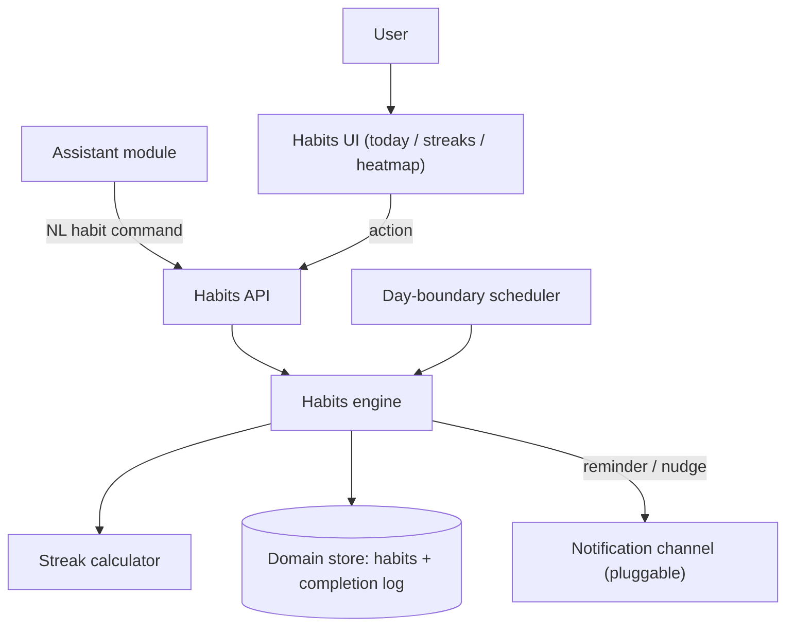
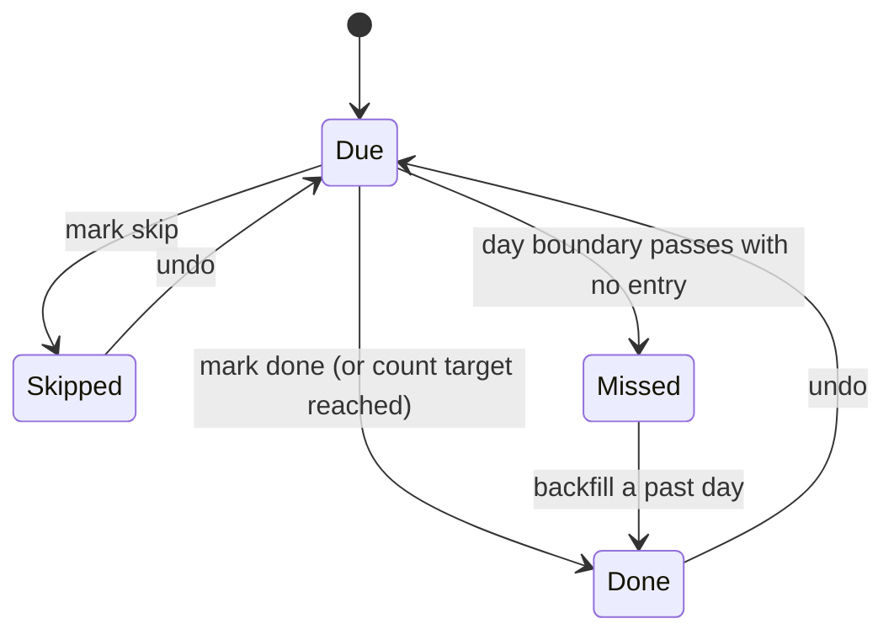
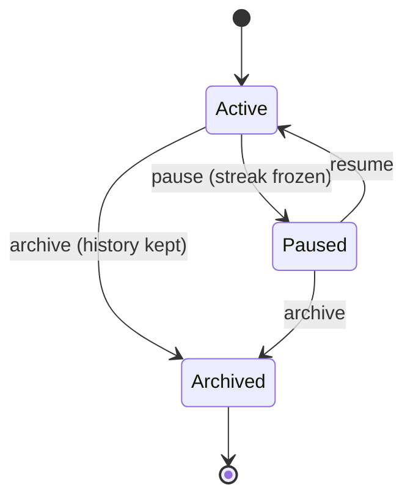
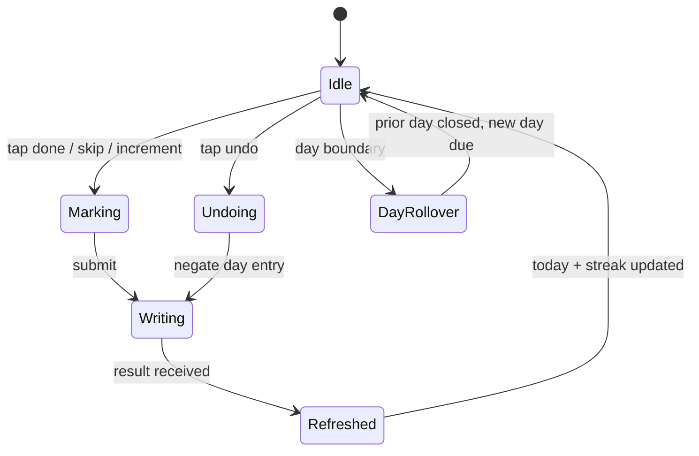

# Habit Tracking System — Functional Specification

> **Document type:** Abstract external specification (clean-room).
> **Purpose:** Define the observable behavior, contracts, state transitions, and edge
> cases of a local habit-tracking module, so the
> `custom_business_suite/habits` module can be built from requirements rather than from a
> copy of any reference implementation.
>
> This document describes **what** the system does, not **how** it is coded. It
> contains no source code, pseudo-code, query text, or pattern literals. Anything tied
> to a particular host or provider is called out as an *Implementation note* and should
> be treated as a replaceable adapter, not a requirement.

---

## 1. Overview & Purpose

The system is a **daily habit tracker** — it holds a set of habits a user wants to do on
a cadence, records whether each was done on each applicable day, and reports **streaks**
and history. A user defines habits, marks them done/skipped — by tapping, by natural
language through the assistant, or automatically at day boundaries — and the system keeps
current/longest streaks, completion rates, and a heatmap.

The defining design choice is an **append-only completion log with derived streaks**:

- The source of truth is a **log of completion entries** (one per habit per day it was
  acted on), not a mutable "current streak" counter.
- **Streaks, rates, and the heatmap are derived** from the log against each habit's
  cadence, so any figure is reproducible and a correction is just another log entry.
- A **day-boundary process** (Section 6.6) closes each day: it does not fabricate
  completions but establishes which scheduled days were missed, which anchors streak math.

**Rationale.** Storing only a running streak would drift and could not be audited or
backfilled; deriving from an append-only log makes streaks trustworthy, lets the user log
a past day, and keeps history intact.

**Design principles (requirements).**

- **Local-first / offline-capable.** Defining habits, logging, and computing streaks must
  work with no external network. Reminders are an enhancement whose absence degrades
  gracefully.
- **Log is truth.** Streaks, rates, and heatmaps are derived from the completion log;
  a rebuild reproduces identical figures.
- **Cadence-aware.** "Missed" and "streak" are defined relative to each habit's schedule,
  not to raw calendar days (a weekday habit is not broken by a weekend).
- **Every action produces a plain-language result.** Results are short sentences suitable
  for display or text-to-speech via the assistant.
- **Deterministic day math.** Streak and reset logic are exact and reproducible given the
  log, the cadence, and the clock.

---

## 2. System Context & Actors

### 2.1 Actors and external roles

| Actor / role | Responsibility |
| :--- | :--- |
| **User** | Defines habits, marks them done/skipped, reads streaks and history. |
| **Habits engine** | Orchestrates each action: validate → append log entry → derive streak → reply. |
| **Streak calculator** | Derives current/longest streak, completion rate, and heatmap from the log against a cadence. |
| **Domain store** | Persistent record of habits, completion-log entries, and derived-state caches. |
| **Day-boundary scheduler** (pluggable) | Runs the daily close/reset and fires reminders. |
| **Notification channel(s)** (pluggable) | Delivers habit reminders/nudges to an outside destination. |
| **Assistant module** (peer) | Sends natural-language habit commands and reads today's habits for grounding. |

### 2.2 Pluggable interfaces (portability requirement)

- **Day-boundary/scheduler interface** — "invoke a callback at the day boundary and when
  a reminder is due." Implementation note: may be the assistant's shared background
  scheduler, running the daily close and minute-granular reminder checks.
- **Notification interface** — "given a formatted nudge and a target channel, deliver it
  and report which channels succeeded." Shares the suite's messaging adapters.
- **Clock interface** — "current date/time and the local day boundary." Swappable so
  streak math, resets, and reminders are deterministic and testable.

### 2.3 Component boundary (informational)

---

## 3. Processing Pipeline (Behavioral Contract)

Each habit action is processed as an ordered sequence. Ordering is a requirement because
streak derivation depends on a fully-appended log.

1. **Validation guard.** The request is checked for an existing habit target, a valid
   date (defaulting to "today"), and a scheduled day for that habit when logging.
   Malformed input is rejected; nothing is appended.
2. **Normalization.** The date is resolved against the clock; the mark kind (done /
   skip / undo) is resolved; a per-day target is applied for count-style habits.
3. **Idempotent log write.** A completion entry for (habit, day) is appended or updated;
   re-marking the same day does not create duplicates (Section 6.2). Undo removes/negates
   the entry for that day.
4. **Derive streak & state.** The streak calculator recomputes current/longest streak,
   today's status, and completion rate for the affected habit from the log against its
   cadence.
5. **Reminder (re)scheduling.** If marking done clears a pending nudge for the day, that
   reminder is suppressed; otherwise pending reminders remain.
6. **Reply.** A short, plain-language result is returned (and recorded for the assistant
   transcript when the action originated there).

**Result envelope (contract).** Every action returns an object containing at minimum:

| Field | Meaning |
| :--- | :--- |
| `reply` | Human-readable, TTS-friendly sentence describing the outcome. |
| `action` | Short machine code naming the outcome (e.g. "habit_completed", "streak", "today_listed"). Drives client refresh. |
| `habits` | The habit record(s) relevant to the reply, with derived streak (possibly empty). |
| `streak` | Current/longest streak for the affected habit (possibly absent). |

Consumers must tolerate extra fields and the absence of action-specific ones.

---

## 4. Operation Catalog

Operations the module recognizes, whether from UI actions or parsed from assistant
natural language. When parsed, entries are tested top-to-bottom and the first match
wins; more specific intents precede general ones.

| # | Operation | Recognized meaning (example phrasing) | Extracted parameters | Side effect | Returned `action` |
| :-- | :--- | :--- | :--- | :--- | :--- |
| 0 | **Confirm-Yes / No** | Affirmative/negative **only when a pending confirmation is active** (e.g. delete-habit offer) | (pending context) | Executes or discards the pending action | `confirmed` / `canceled` |
| 1 | **Mark-Done** | "mark meditation done", "did my workout" | habit, date? | Appends a done entry for the day | `habit_completed` |
| 2 | **Mark-Skip** | "skip reading today" | habit, date? | Appends a skip entry (protects streak per policy) | `habit_skipped` |
| 3 | **Undo-Mark** | "undo water", "I didn't actually run" | habit, date? | Removes/negates the day's entry | `mark_undone` |
| 4 | **Increment-Count** | "log another glass of water" | habit, amount? | Raises a count-habit's daily tally | `count_updated` |
| 5 | **Create-Habit** | "add a habit: meditate daily" | name, cadence, target?, reminder? | Creates a habit | `habit_created` |
| 6 | **Edit-Habit** | "change gym to 3 times a week" | habit, changed-fields | Updates cadence/target/name | `habit_edited` |
| 7 | **Pause / Resume** | "pause journaling", "resume it" | habit | Suspends/resumes scheduling (streak frozen, not broken) | `habit_paused` / `habit_resumed` |
| 8 | **Archive / Delete** | "delete the flossing habit" | habit | Archives (keeps history) or deletes | `habit_archived` / `habit_deleted` |
| 9 | **Set-Reminder** | "remind me to stretch at 8pm" | habit, time, channel? | Attaches a daily reminder | `reminder_set` |
| 10 | **Today / What's-Left** | "what habits are left today" | date? | Reads today's due-and-undone habits | `today_listed` |
| 11 | **Streak-Query** | "what's my meditation streak" | habit | Reads derived current/longest streak | `streak` |
| 12 | **History / Heatmap** | "show my running history" | habit, window? | Reads completion history/heatmap | `history` |
| 13 | **List-All-Habits** | "what habits do I track" | — | Reads all habits with today's status + streak | `habits_listed` |
| 14 | **Rate-Query** | "how often do I actually read" | habit, window? | Reads completion rate over a window | `rate` |

**Precedence notes (behavioral requirements).**

- Pending-confirmation handling is checked **first**, and only when a pending context
  exists (chiefly the delete-habit offer).
- Undo-Mark and Increment-Count are tested **before** Mark-Done so corrections and
  count logging are not misread as a fresh full completion.
- Mark-Skip is distinguished from Mark-Done by skip language ("skip", "not today") and is
  treated per the streak policy (Section 6.4), not as a miss.
- Handlers reject a habit name that doesn't match a known habit (offering to create it)
  and a log against a day the habit is not scheduled (with a clear message).

---

## 5. State & Lifecycle

### 5.1 Pending confirmation (single-slot)

Mirrors the assistant's short-lived confirmation model. Set when a handler ends with a
yes/no question — chiefly **delete-habit** and **create-unknown-habit** offers. Resolved
on the next turn and cleared immediately; honored only within a short expiry window
(reference: **5 minutes**).

### 5.2 Per-day habit status

For each scheduled day, a habit's day-status is derived from the log:

Non-scheduled days are **Not-Due** and never count as misses.

### 5.3 Habit lifecycle

---

## 6. Domain Behaviors

### 6.1 Cadence model

- A habit's cadence is one of: **daily**, **specific weekdays** (e.g. Mon/Wed/Fri),
  **N-times-per-week** (a weekly quota without fixed days), or **every-N-days**.
- The cadence defines each day's **scheduled/not-scheduled** status, which drives
  due-today, missed, and streak logic.

### 6.2 Idempotent logging

- A completion entry is keyed by (habit, day); marking the same day again updates rather
  than duplicates. For count habits the entry holds a running tally with a per-day
  target; "done" is reached when the tally meets the target.
- Undo removes the day's entry (or decrements a count), returning the day to Due.

### 6.3 Streak calculation

- **Current streak** counts consecutive **scheduled** days satisfied up to today
  (today counts if done; a still-Due today does not break the streak until the day
  closes).
- **Longest streak** is the maximum such run over history.
- Non-scheduled days are transparent — they neither extend nor break a streak (a weekday
  habit's streak survives the weekend).

### 6.4 Skip, grace & freeze policies (streak protection)

- **Skip** marks an intentional non-completion; per policy it **protects** the streak
  (does not count as a miss) but does not extend it.
- An optional **grace/freeze** allowance lets a limited number of missed scheduled days
  per window not break the streak (configurable per habit; default none).
- **Pause** freezes the streak: paused days are neither due nor missed; on resume the
  streak continues from where it froze.

### 6.5 N-times-per-week quota

- For quota cadences, satisfaction is evaluated **per week**: the week is met when the
  count of done-days reaches the target, regardless of which days. Streaks count
  consecutive **met weeks** rather than days.

### 6.6 Day-boundary close & reset

- At the local day boundary the scheduler **closes the prior day**: scheduled habits with
  no entry become **Missed** (anchoring streak breaks), and the new day's scheduled
  habits become **Due**.
- The close **fabricates nothing** — it does not auto-complete or auto-skip; it only
  establishes due/missed status so derivations are stable.

### 6.7 Heatmap & completion rate

- The heatmap renders per-day status over a window (done/skip/missed/not-due).
- **Completion rate** over a window = done scheduled days ÷ total scheduled days,
  computed from the log; skips are excluded from the denominator per policy.

### 6.8 Reminders

- A habit may carry a daily reminder time; the scheduler fires it (minute granularity) to
  the bound channel unless the habit is already done for the day, with duplicate-fire
  suppression.

---

## 7. Assistant Integration

The habits module is a first-class tool set for the suite assistant, per the README's
"sync together using the assistant."

**Natural-language intents surfaced to the assistant.** The assistant routes habit
phrasings to the operations in Section 4. Representative mappings:

| User says (to assistant) | Habits operation | Reply shape |
| :--- | :--- | :--- |
| "mark meditation done" | Mark-Done | "Nice — meditation done. 12-day streak." |
| "did I work out today" | Today / Streak-Query | "Not yet — workout is still due today." |
| "what habits are left today" | Today | "2 left: read and stretch." |
| "what's my running streak" | Streak-Query | "Running: 8 now, best 21." |
| "log another glass of water" | Increment-Count | "Water: 5 of 8 today." |

**Grounding summary provided to the assistant model.** On request the module supplies a
compact context: today's due-and-remaining habits, each with current streak, plus overall
today-progress — capped in size (never the full log), matching the assistant's
small-context RAG contract.

**Cross-module sync (requirements).**

- **Today's habits → Calendar agenda.** A habit's cadence surfaces as a recurring agenda
  marker so "what's on today" includes due habits (read-through; habits remain owner).
  See Calendar module.
- **Habits ↔ Checklist dailies.** A daily habit may mirror a recurring checklist task;
  completing one can satisfy the other so the user isn't tracking the same thing twice.
  See Checklist module.
- **Daily reset & nudges via assistant scheduler.** The day-boundary close and reminder
  nudges reuse the suite's shared scheduler and notification channels.

Mutations are always driven by the deterministic habits engine; the assistant model
produces only conversational text and never writes log entries directly.

---

## 8. API Contract

All endpoints are served by the application backend under `/api/habits`. Paths and shapes
below are the contract the client and assistant depend on.

### 8.1 Habits

| Method | Path | Purpose | Key request fields | Key response fields |
| :--- | :--- | :--- | :--- | :--- |
| GET | `/api/habits/habits` | List habits with today status + streak | query: `include_archived?` | `habits`, `count` |
| POST | `/api/habits/habits` | Create a habit | `name`, `cadence`, `target?`, `reminder?`, `grace?` | `habit` |
| PATCH | `/api/habits/habits/<id>` | Edit cadence/target/name/reminder | changed fields | `habit` |
| POST | `/api/habits/habits/<id>/pause` | Pause/resume scheduling | `paused` | `habit` |
| DELETE | `/api/habits/habits/<id>` | Archive/delete a habit | query: `archive?` | `success` |

### 8.2 Logging, streaks & history

| Method | Path | Purpose | Key request fields | Key response fields |
| :--- | :--- | :--- | :--- | :--- |
| POST | `/api/habits/log` | Mark done/skip/undo/increment for a day | `habit`, `kind` (done/skip/undo), `date?`, `amount?` | `habit`, `streak` |
| GET | `/api/habits/today` | Today's due habits + status | query: `date?` | `habits`, `remaining` |
| GET | `/api/habits/habits/<id>/streak` | Derived current/longest streak | — | `current`, `longest` |
| GET | `/api/habits/habits/<id>/history` | Per-day history / heatmap | query: `from?`, `to?` | `days[]`, `rate` |
| GET | `/api/habits/summary` | Compact grounding summary for the assistant | query: `date?` | `due_today[]`, `streaks[]`, `progress` |

**Validation & status expectations.** Missing/malformed required fields (unknown habit,
invalid cadence, log against a non-scheduled day, unparseable date) yield a client-error
status with an `error` message and `success: false`. Successful mutating calls return
`success: true`.

**Authentication (context).** Endpoints sit behind the suite's session gate and return an
unauthorized status without a valid session; the auth mechanism is out of scope.

---

## 9. Data Model (Logical)

Types are descriptive; text comparisons are case-insensitive. Streaks/rates are derived,
not stored as authoritative values (a cache may exist but must be rebuildable).

**Habits** — one row per tracked habit.

| Field | Type | Notes |
| :--- | :--- | :--- |
| id | identifier | primary key |
| name | text | unique, case-insensitive |
| icon | text | representative glyph |
| cadence_type | text | daily / weekdays / n_per_week / every_n_days |
| cadence_detail | text | weekday set / N / interval, per type |
| target | integer | per-day count target (count habits; default 1) |
| grace | integer | allowed misses per window before break (default 0) |
| reminder_time | text | daily reminder (nullable) |
| state | text | active / paused / archived |
| created_at / updated_at | timestamps | maintained on write |

**Completion log** — append-only, one entry per (habit, day) acted on.

| Field | Type | Notes |
| :--- | :--- | :--- |
| id | identifier | primary key |
| habit_id | identifier | owning habit |
| day | date | the scheduled day acted on |
| kind | text | done / skip |
| count | integer | tally for count habits (default 1) |
| created_at | timestamp | ordering / audit |

*(Uniqueness on (habit_id, day) enforces idempotent logging; "missed" days have no entry
and are derived at read time.)*

**Derived-state cache (optional)** — a rebuildable rollup for fast reads.

| Field | Type | Notes |
| :--- | :--- | :--- |
| habit_id | identifier | key |
| current_streak / longest_streak | integer | derived; rebuildable from the log |
| last_computed | timestamp | invalidation marker |

**Reminders** — daily nudges (may be inlined on the habit or separate).

| Field | Type | Notes |
| :--- | :--- | :--- |
| id | identifier | primary key |
| habit_id | identifier | target habit |
| time_str | text | 24-hour time |
| channel | text | target channel(s) |
| last_fired | timestamp | duplicate-fire suppression |
| enabled | flag | on/off |

**Pending context** — single-slot conversational state (Section 5.1): keyed record with a
serialized payload and an update timestamp used for expiry.

---

## 10. Client / UI Interaction

**Primary views.**

- **Today** — due habits with a one-tap done/skip control and remaining count.
- **Streaks** — per-habit current/longest streak with progress toward a milestone.
- **Heatmap** — calendar grid of per-day status over a window.
- **History / rate** — completion rate and trend for a chosen habit and window.

**Log flow (UI state machine).**

**Post-action data refresh.** When a result's `action` indicates data changed
(habit_completed/skipped, mark_undone, count_updated, habit_created/edited/paused/
archived/deleted), the client refreshes today, streaks, and heatmap views so they match
the derived state.

**Day-rollover handling.** The client observes the day boundary (or a rollover signal),
re-fetches today's due habits, and reflects any newly-missed prior-day statuses without
altering the log.

---

## 11. Edge Cases & Error Handling

| Situation | Required behavior |
| :--- | :--- |
| Log against a non-scheduled day | Reject with a message that the habit isn't scheduled that day (or offer a one-off log per policy). |
| Re-mark an already-done day | Idempotent — update, do not duplicate; report it's already done. |
| Undo with no entry for the day | No-op; report there was nothing to undo. |
| Count incremented past target | Cap at target and mark done; report the overflow. |
| Unknown habit name (assistant) | Offer to create it via the pending confirmation; do not error. |
| Backfilling a past day | Allowed; append a dated entry and re-derive streaks including that day. |
| Paused habit | Neither due nor missed while paused; streak frozen, resumes on unpause. |
| Skip on a due day | Protects the streak per policy; excluded from the rate denominator. |
| Missed scheduled day beyond grace | Breaks the current streak at the day boundary; longest streak preserved. |
| Weekend/off-day for a weekday habit | Not-due; never counts as a miss. |
| Reminder channel not configured | Report the nudge inline; do not fail the log. |
| Duplicate reminder fire within the same minute | Suppressed via the last-fired stamp. |
| Missing required API fields | Return a client-error status with an explanatory message. |

**General principle:** external-dependency failures degrade gracefully to a useful
result; only malformed input or an off-schedule log is rejected outright.

---

## 12. Non-Functional Requirements

- **Local-first / offline core.** Defining habits, logging, and computing streaks work
  with no external connectivity.
- **Auditable & reproducible.** Streaks, rates, and heatmaps are re-derivable from the
  completion log; a rebuild reproduces identical figures.
- **Cadence-correct math.** Missed/streak logic honors each habit's schedule, not raw
  calendar days.
- **Deterministic day handling.** Given the log, cadence, and clock, day-close and streak
  results are reproducible.
- **Low latency.** Logging and streak derivation feel instantaneous for a normal habit
  count and history length.
- **Determinism split.** Habit operations are deterministic; only the assistant's
  conversational layer is probabilistic, and it never writes log entries.
- **Resilience.** Any single external dependency (notifier, scheduler) can be down
  without breaking core tracking; the day-close can re-run idempotently after downtime.
- **Concurrency.** The API serves simultaneous requests; the day-boundary scheduler runs
  independently of request handling.

---

## 13. Assumptions & Portability Notes

- **Single active user/zone.** One user and one local day boundary are assumed, injectable
  via the clock interface so day math is deterministic and testable.
- **Cadence subset.** Daily / weekday-set / N-per-week / every-N-days are the baseline;
  richer schedules would extend `cadence_detail` without changing the derivation contract.
- **Streak policy is configurable.** Skip-protection and grace/freeze defaults (default:
  skip protects, grace 0) are per-habit knobs; changing them re-derives from the same log.
- **Notification and scheduler providers are replaceable** via their interfaces
  (Section 2.2); concrete adapters are shared with the rest of the suite, and the
  day-boundary/reminder scheduler may be the assistant's.
- **Derived cache is optional.** Any stored streak cache is a performance aid only and
  must be fully rebuildable from the completion log.
- **Host coupling is out of scope.** Session auth and host-specific concerns are provided
  by the surrounding suite, not by the habits contract.

---

*End of specification.*
